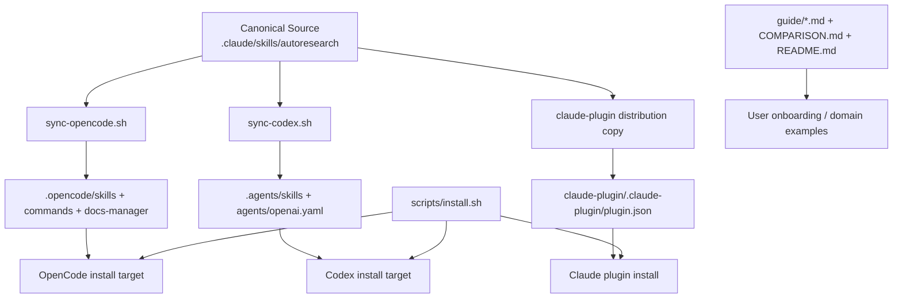

# autoresearch 저장소 상세 분석

- 분석 대상: `uditgoenka/autoresearch`
- 분석 시점: 2026-04-10 (KST)
- 분석 방식: GitHub 저장소 메타데이터 확인, shallow clone, 핵심 Markdown/스크립트/매니페스트 검토
- 검증 한계: 이 저장소는 실행 코드보다 스킬 문서와 배포 스크립트 비중이 매우 높아서, 일반적인 `test`/`build` 실행 검증 대상이 거의 없다. 대신 실제 파일 구조와 배포 스크립트, 문서 일관성을 중심으로 평가했다.

## 한 줄 요약

`autoresearch` 는 런타임 제품이라기보다, **Karpathy식 "goal + metric + loop" 방법론을 Claude Code, OpenCode, Codex 세 에이전트 환경에 맞춰 포팅한 문서형 skill distribution 저장소**다. 핵심 가치는 코드 구현체보다 **프로토콜 설계, 호스트별 적응 계층, 그리고 긴 운영 문서 세트**에 있다.

## 저장소 스냅샷

### GitHub 기준 스냅샷

2026-04-10 기준 GitHub 저장소 페이지와 원격 refs 를 통해 확인한 값은 다음과 같다.

| 항목 | 값 |
| --- | --- |
| 공개 여부 | Public |
| 기본 브랜치 | `master` |
| Stars | 약 3.4k |
| Forks | 263 |
| Open Issues | 1 |
| Open PRs | 1 |
| Commits | 141 |
| 원격 브랜치 수 | 4 |
| 원격 태그 수 | 45 |
| 최신 태그 | `v2.0.0-beta.0.2` |
| 최근 커밋 | `bd978ff` (2026-04-06) `feat: add OpenAI Codex support with full skill port, sync tooling, and installer` |

### 코드베이스 기준 스냅샷

`.git` 을 제외한 tracked 파일 기준으로 보면 구조는 매우 문서 중심이다.

| 항목 | 값 |
| --- | --- |
| tracked files | 126 |
| Markdown 파일 | 115 |
| skill 파일 | 4 |
| command 문서 | 30 |
| reference 문서 | 48 |
| guide 문서 | 27 |
| JSON 파일 | 3 |
| 스크립트 파일 | 5 |
| shell 스크립트 총 라인 수 | 690 |
| GitHub Actions workflow | 0 |

이 숫자가 말해주는 건 분명하다. 이 레포는 `src/`, `lib/`, 테스트 러너, 앱 코드가 중심이 아니라 **문서와 배포 구조가 곧 제품**이다.

## 이 저장소를 어떻게 봐야 하나

`autoresearch` 는 아래 네 층으로 이해하면 제일 잘 읽힌다.

1. **정식 방법론 층**: Autoresearch loop, git memory, verify/guard, rollback 규칙
2. **호스트 적응 층**: Claude Code 문법, OpenCode 문법, Codex 문법으로의 변환
3. **배포 층**: Claude plugin 배포물, 수동 복사, install/sync/release 스크립트
4. **교육/사용 예시 층**: 가이드, 도메인 예시, 시나리오 카탈로그, 비교 문서

즉, 이 저장소는 "AI가 자동 개선을 해준다"는 주장 자체보다, **그 주장을 각 에이전트 환경에서 재사용 가능한 운영 프로토콜로 패키징하는 것**이 본업이다.

## 아키텍처 요약

이 구조에서 중요한 점은 **`.claude/` 가 소스 오브 트루스**이고, 나머지는 배포 또는 포트라는 것이다.

## 핵심 설계 포인트

### 1. 이 저장소는 런타임 제품이 아니라 프로토콜 제품이다

실제 구현 코드를 기대하고 열어보면 다소 의외일 수 있다.  
`autoresearch` 는 브라우저, 서버, API 런타임 같은 실행 엔진을 제공하지 않는다. 대신 아래를 제공한다.

- 에이전트가 따라야 할 루프 규칙
- 명령별 상세 SOP
- 설치 대상별 명령 문법 적응
- 배포/릴리스 절차
- 실제 활용 예시와 문서화 패턴

즉, 이 저장소의 핵심 산출물은 코드가 아니라 **행동 규칙이 명시된 Markdown 아티팩트**다.

### 2. `.claude/` 가 정본이고 나머지는 파생물이다

`CONTRIBUTING.md` 와 스크립트를 보면 구조가 명확하다.

- `.claude/skills/autoresearch/` = 정본
- `.opencode/` = OpenCode 포트
- `.agents/` = Codex 포트
- `claude-plugin/` = Claude 배포 패키지

즉, 유지보수 모델은 "여러 구현체를 직접 수정"이 아니라, **Claude 원본을 바꾸고 스크립트로 다른 호스트용으로 적응**하는 방식이다.

이 구조의 장점:

- 컨셉과 프로토콜 변경을 한 군데서 관리할 수 있음
- 호스트별 차이를 스크립트에 모아둘 수 있음

이 구조의 비용:

- 파생본이 많아질수록 드리프트 위험이 커짐
- 자동 동기화가 완전하지 않으면 문서와 매니페스트가 어긋나기 쉬움

### 3. 호스트별 적응은 문법만 바꾸는 수준이 아니다

`scripts/sync-opencode.sh` 와 `scripts/sync-codex.sh` 를 보면 단순 문자열 치환 이상을 한다.

#### OpenCode 적응

- `AskUserQuestion` → `question`
- `/autoresearch:foo` → `/autoresearch_foo`
- 일부 도구 언어와 frontmatter 호환성 변환

#### Codex 적응

- `/autoresearch:foo` → `$autoresearch foo`
- `AskUserQuestion` → direct prompting
- 경로 `.claude/...` → `.agents/...`
- `agents/openai.yaml` 생성
- frontmatter 를 Codex 호환 형태로 재작성

즉, `autoresearch` 는 "하나의 스킬을 복붙"하는 게 아니라, **호스트별 대화/명령/메타데이터 규약에 맞게 번역되는 포트 시스템**을 이미 가지고 있다.

### 4. 코어 프로토콜은 생각보다 엄격하고 길다

정본 기준 reference 문서 12개 총 라인 수는 6,341줄이다. 특히 긴 문서는 다음과 같다.

| 문서 | 라인 수 |
| --- | --- |
| `security-workflow.md` | 1,000 |
| `autonomous-loop-protocol.md` | 890 |
| `predict-workflow.md` | 751 |
| `fix-workflow.md` | 682 |
| `reason-workflow.md` | 618 |

즉, 이 저장소의 "기능" 은 구현 코드가 아니라 **굉장히 상세한 운영 프로토콜** 안에 들어 있다.

`autonomous-loop-protocol.md` 에서 특히 중요한 축은 다음과 같다.

- git 저장소/dirty tree/lock/detached HEAD 사전 검사
- 각 이터레이션 전 `git log`, `git diff` 확인
- experiment 커밋을 memory 로 사용하는 규칙
- 실패 시 `git revert` 를 통한 rollback
- bounded / unbounded loop 구분

이는 Karpathy의 아이디어를 단순히 요약하는 수준이 아니라, **에이전트가 실제로 따라야 할 수행 절차로 변환한 것**에 가깝다.

### 5. 커맨드 서피스는 넓지만 모두 같은 루프 철학 위에 서 있다

표면적으로는 10개 커맨드를 제공한다.

| 커맨드 | 역할 |
| --- | --- |
| `autoresearch` | 기본 loop |
| `plan` | goal/metric/scope 설계 |
| `debug` | 버그 사냥 |
| `fix` | 에러 수정 |
| `security` | STRIDE + OWASP 감사 |
| `ship` | 출하/배포 workflow |
| `scenario` | 시나리오/엣지케이스 생성 |
| `predict` | 다중 전문가 시점 사전 검토 |
| `learn` | 문서화 엔진 |
| `reason` | 주관적 판단 영역의 adversarial refinement |

중요한 건 이 명령들이 전혀 별개 제품이 아니라는 점이다.  
전부 아래 철학을 공유한다.

- 한 번에 한 변화
- 기계적 검증
- 결과 로그
- 실패 시 되돌리기
- 필요한 경우 체이닝

즉, 이 프로젝트의 확장성은 "새 툴 추가"보다 **같은 loop 철학을 다른 문제군에 적용**하는 방식으로 커진다.

### 6. Codex 포트는 최근에 추가됐고, 아직 안정화 중이다

이 저장소의 최근 커밋 메시지 자체가 Codex 지원 추가다.  
그리고 현재 GitHub 상태를 보면 Codex 지원이 아직 아주 매끈하게 끝난 건 아니다.

- 최근 커밋: Codex support 추가
- 오픈 이슈: [#25](https://github.com/uditgoenka/autoresearch/issues/25) `support openai codex ?`
- 오픈 PR: [#68](https://github.com/uditgoenka/autoresearch/pull/68) `fix: quote skill descriptions in frontmatter`

특히 PR #68 의 요지는 Codex 에서 `SKILL.md` frontmatter 의 `description` 이 unquoted 라서 로딩이 깨졌다는 것이다.  
실제 현재 저장소의 `.agents/skills/autoresearch/SKILL.md` 도 긴 `description:` 값이 인용부호 없이 들어 있다.

이건 중요한 시그널이다.

- Codex 지원은 실제로 들어왔음
- 하지만 아직 포팅 안정화 이슈가 남아 있음
- 자동 검증이 없으니 이런 문제는 사용 중에 발견되기 쉬움

### 7. 배포 체계는 단순하지만 수작업 의존성이 높다

`scripts/install.sh` 는 구조가 단순하다.

- 설치 대상 선택: Claude / OpenCode / Codex
- 설치 위치 선택: global / local
- 대상 경로 계산
- 적절한 디렉터리 복사

좋은 점:

- 의존성이 적고 이해하기 쉬움
- 사용자 입장에서 설치가 복잡하지 않음

아쉬운 점:

- 결국 파일 복사 기반이라 drift 검출이 약함
- install 이후 실제 로딩 성공 여부를 자동 검증하지 않음
- YAML/frontmatter/명령 등록 문제를 사전에 잡아내지 못함

즉, 사용성은 좋지만 **패키지 무결성 검증 레이어는 얇다.**

### 8. 문서 세트 자체가 제품의 절반 이상이다

`guide/` 문서 라인 수는 총 9,876줄이고, 그중 큰 문서만 봐도 밀도가 높다.

| 문서 | 라인 수 |
| --- | --- |
| `examples-by-domain.md` | 1,303 |
| `advanced-patterns.md` | 786 |
| `autoresearch-predict.md` | 778 |
| `autoresearch-security.md` | 512 |
| `autoresearch.md` | 511 |
| `chains-and-combinations.md` | 501 |

즉, 이 레포는 설치 파일 몇 개보다도 **가이드를 읽고 제대로 쓰는 것**이 훨씬 중요하다.

특히 강한 점은 다음과 같다.

- 단순 기능 소개가 아니라 실제 사용 예시가 많다
- 소프트웨어 밖의 도메인까지 확장한다
- scenario 문서군이 "엣지 케이스 사전 사고" 용 사례집 역할을 한다

이건 프롬프트 레포들이 흔히 약한 부분인데, `autoresearch` 는 오히려 문서 쪽이 제일 강하다.

## 이 저장소의 강점

### 1. 아이디어를 저장소 구조로 잘 번역했다

Karpathy식 loop 를 단순 소개글이 아니라 실제 명령 체계와 SOP 로 풀어냈다.

### 2. 호스트 확장 전략이 명확하다

Claude 정본 → OpenCode/Codex 포트라는 구조가 분명해서 읽는 사람이 길을 잃지 않는다.

### 3. 문서 밀도가 높다

기능 설명, 도메인 예시, 체이닝, 시나리오 샘플, 비교 문서까지 있어 학습 곡선이 낮다.

### 4. 코어 철학이 일관된다

debug, fix, security, reason 같은 기능이 제각각 떠다니지 않고 같은 loop 철학으로 묶인다.

### 5. 설치 스크립트가 단순하다

배포 메커니즘이 지나치게 무겁지 않아서 개인 사용자에게 부담이 적다.

## 이 저장소의 리스크

### 1. 자동 검증이 거의 없다

GitHub Actions workflow 가 없고, 테스트 코드도 없다.  
품질 보증은 사실상 문서 검토와 실제 로딩 경험에 의존한다.

### 2. 버전 드리프트가 이미 눈에 띈다

현재 저장소에서 확인되는 버전 표기는 서로 다르다.

- README 배지: `2.0.0-beta.0.2`
- 태그: `v2.0.0-beta.0.2`
- Claude plugin manifest: `1.9.0`
- `.claude` / `.agents` SKILL frontmatter: `1.9.11`
- `guide/README.md`: `1.9.0`
- 일부 guide 배지: `1.8.1`

즉, 배포 버전, 문서 버전, 포트 버전이 아직 완전히 정렬돼 있지 않다.

### 3. 문서 중복이 많다

정본 + Claude distribution + OpenCode port + Codex port 구조라 reference 문서만 48개다.  
동기화 스크립트가 있어도 사람이 놓치기 쉬운 지점이 많다.

### 4. 일부 문서 숫자도 어긋난다

예를 들면 `plugin.json` 은 "10 subcommands" 라고 적지만 실제로는 기본 커맨드 1개 + 서브커맨드 9개로 읽는 편이 맞다.  
`COMPARISON.md` 에서는 11 subcommands 라는 표현도 보여 현재 표기 체계가 완전히 고정되지 않았다.

### 5. 방법론이 강해서 잘못 쓰면 과도하게 공격적일 수 있다

`EXECUTE IMMEDIATELY`, 무한 loop, 반복 실험, 자동 rollback 같은 지시문은 레버리지가 크지만, 에이전트 환경과 사용자 기대가 맞지 않으면 꽤 강압적으로 느껴질 수 있다.

## 문서/구현 드리프트 정리

이 저장소는 작은 규모에 비해 드리프트 신호가 꽤 선명하다.

### 1. 버전 관리

릴리스 태그는 `v2.0.0-beta.0.2` 인데, 매니페스트와 스킬 frontmatter, 가이드 배지가 서로 다른 버전을 가리킨다.

### 2. Codex 지원의 성숙도

README 는 Codex 지원을 명시하지만, 실제로는 관련 이슈와 frontmatter 수정 PR 이 아직 열려 있다.

### 3. 문서 내 커맨드 수 표기

10 commands, 10 subcommands, 11 subcommands 표현이 섞여 있다.

### 4. 릴리스 스크립트의 전제

`scripts/release.sh` 는 `master` 브랜치, `gh` 설치, 수동 문서 리뷰, 수동 merge 승인 등 사람 중심 절차를 전제로 한다.  
자동 릴리스 파이프라인이라기보다 **반자동 출하 스크립트**에 가깝다.

## 어떤 사용자에게 맞는가

이 저장소는 아래 사용자에게 특히 잘 맞는다.

- Claude Code / OpenCode / Codex 를 직접 많이 쓰는 개인 개발자
- "goal + metric + loop" 방식으로 자동 개선을 시도하고 싶은 사용자
- 문서형 스킬을 읽고 직접 커스터마이즈할 수 있는 사용자
- 특정 런타임보다 작업 방법론을 가져가고 싶은 사용자

반대로 아래 사용자에게는 덜 맞을 수 있다.

- 앱/라이브러리 같은 실행 코드를 기대한 사용자
- 테스트/CI 로 보증된 안정성을 먼저 원하는 팀
- 버전 정합성과 배포 자동화가 엄격해야 하는 조직
- 프롬프트/스킬보다 런타임 도구를 원하는 사용자

## 추천 읽기 순서

이 저장소를 빠르게 파악하려면 아래 순서가 좋다.

1. `README.md`
2. `CONTRIBUTING.md`
3. `.claude/skills/autoresearch/SKILL.md`
4. `.claude/skills/autoresearch/references/autonomous-loop-protocol.md`
5. `scripts/install.sh`
6. `scripts/sync-opencode.sh`
7. `scripts/sync-codex.sh`
8. `claude-plugin/.claude-plugin/plugin.json`
9. `.agents/skills/autoresearch/SKILL.md`
10. `guide/README.md`
11. `guide/examples-by-domain.md`
12. `COMPARISON.md`

## 최종 평가

`autoresearch` 의 본질은 "자동으로 무언가를 잘 해주는 AI 도구" 가 아니라, **에이전트가 반복 개선 실험을 수행하도록 만드는 운영 프로토콜 패키지**다.

이 저장소는 아래 세 가지를 잘한다.

1. Karpathy의 아이디어를 일반화한다
2. 그 일반화를 호스트별 스킬로 배포한다
3. 긴 문서와 예시로 사용 문맥까지 채워 넣는다

반면 아래는 아직 약하다.

1. 자동 검증
2. 버전 정합성
3. 포트별 드리프트 관리

그래서 이 저장소를 평가할 때는 "코드 품질" 보다 **프로토콜 설계력, 문서 품질, 포트 유지보수 체계, 그리고 버전/배포 정합성**을 중심에 두고 보는 게 맞다.

## 검증 메모

- GitHub 저장소 페이지를 확인했다
- 저장소를 shallow clone 해서 실제 파일 구조를 읽었다
- `README.md`, `CONTRIBUTING.md`, `AGENTS.md`, `COMPARISON.md`, `.claude/*`, `.agents/*`, `.opencode/*`, `claude-plugin/*`, `scripts/*`, `guide/*` 를 중심으로 검토했다
- 실행 코드 테스트는 없고, GitHub Actions workflow 도 없다
- 현재 Codex 지원 관련 오픈 이슈/PR 상태까지 반영했다
