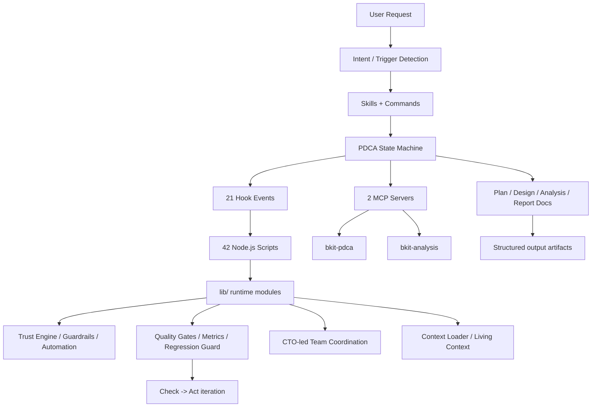

# `bkit-claude-code` 저장소 상세 분석

분석 대상: `https://github.com/popup-studio-ai/bkit-claude-code`  
분석 시점: `2026-04-10`  
분석 방식: GitHub 공개 저장소 페이지를 확인하고, 원격 저장소를 shallow clone 한 뒤 README, plugin metadata, PDCA 설정, hook/event 구조, 핵심 `lib/` 모듈, MCP 서버, 테스트 트리, 사용자 가이드를 직접 읽어 정리.

## 한 줄 요약

`bkit-claude-code`는 Claude Code용 skill/agent 모음이라기보다, **PDCA 문서 주도 개발 + Context Engineering + Controllable AI 거버넌스**를 Claude Code 플러그인 형태로 구현한 "AI-native development OS"에 가깝다.

## 스냅샷 요약

- GitHub 공개 페이지 기준 (`2026-04-10` 확인):
  - Public repository
  - Star 약 `488`
  - Fork 약 `123`
  - Open issues `1`
  - Open pull requests `0`
  - Commit 표기 `281`
  - 기본 브랜치 `main`
- 플러그인 버전: `2.1.1`
- 라이선스: `Apache-2.0`
- 로컬 clone 기준:
  - 추적 파일 수 `637`
  - skill 디렉터리 `38`
  - agent markdown 파일 `36`
  - command 파일 `2`
  - hook 이벤트 `21`
  - script 파일 `42`
  - `lib/` JS 모듈 `84`
  - `servers/` 파일 `4`
  - `evals/` 파일 `95`
  - `test/` 파일 `199`
  - `test/**/*.test.js` 파일 `189`
  - output style 파일 `4`
  - template 파일 `43`
  - `docs/` 파일 `30`
  - `docs/` 하위 phase 디렉터리 `6`
  - `bkit-system/` 파일 `20`
- 내장 MCP 서버: `2`
  - `bkit-pdca`
  - `bkit-analysis`

주의:
- GitHub star/fork/issues/PR/commit 수치는 GitHub UI 스냅샷이라 이후 달라질 수 있다.
- 이 레포는 버전 업 과정에서 남은 문서가 꽤 많아서, README/사용자 가이드/테스트 README/코드가 같은 숫자를 말하지 않는 부분이 있다. 예를 들어:
  - README는 `38 skills / 36 agents / 607 functions`를 말함
  - `AI-NATIVE-DEVELOPMENT.md`는 `20 transitions`를 말하지만 현재 `lib/pdca/state-machine.js`의 transition table은 `25`개다
  - `docs/bkit-v2.0.0-user-guide.md`는 더 오래된 수치(`36 skills / 31 agents / 18 hook events`)를 담고 있다
  - `test/README.md`와 `jest.config.js`는 과거 테스트 구조 흔적을 남긴다

## 이 저장소를 어떻게 봐야 하나

이 레포를 "Claude Code용 플러그인"으로만 보면 핵심을 놓친다. 실제로는 다음 여섯 층이 함께 들어 있다.

1. Claude Code marketplace plugin
2. PDCA 상태 머신 기반 문서 주도 개발 시스템
3. Context Engineering 구현체
4. L0-L4 자동화 레벨과 신뢰 점수 기반 Controllable AI 계층
5. MCP 서버를 통한 상태/분석 API 표면
6. 테스트, 평가, 템플릿, 내부 철학 문서까지 포함한 운영 프레임워크

즉 이 프로젝트는 "좋은 프롬프트 모음"보다 훨씬 더 구조적이다.  
핵심 질문은 "어떤 skill이 있나?"보다 "AI 개발 작업을 어떤 절차와 상태로 통제하나?"에 있다.

## 저장소의 큰 구조

```text
bkit-claude-code/
|
+-- .claude-plugin/             # plugin/marketplace 메타데이터
+-- agents/                     # 36 role-based agent definitions
+-- skills/                     # 38 workflow/capability/hybrid skills
+-- commands/                   # /bkit 등 사용자-facing 명령
+-- hooks/                      # hooks.json + session start bootstrap
+-- scripts/                    # 42 unified hook/event handlers
+-- lib/                        # 84 JS modules, core runtime
+-- servers/                    # 2 MCP servers (pdca / analysis)
+-- evals/                      # skill evals / A-B testing / benchmark
+-- test/                       # 12+ category test suite
+-- output-styles/              # response style presets
+-- templates/                  # PDCA document templates
+-- bkit-system/                # internal knowledge base / architecture docs
+-- docs/                       # user guide + PDCA artifacts + reports
+-- AI-NATIVE-DEVELOPMENT.md    # methodology statement
+-- bkit.config.json            # PDCA/automation/team/guardrail config
`-- .mcp.json                   # MCP server wiring
```

## 이 저장소의 정체성

README와 `AI-NATIVE-DEVELOPMENT.md`는 이 프로젝트를 분명하게 규정한다.

- 문서가 먼저인 개발
- 맥락을 설계하는 Context Engineering
- 에이전트를 역할 기반으로 배치
- 인간 개입을 단계적으로 줄이는 Controllable AI
- 검증 실패 시 Check→Act 반복

핵심 흐름은 다음처럼 요약할 수 있다.

```text
Spec -> Context -> Agents -> Human Oversight -> Continuous Improvement
```

여기서 Spec은 Plan/Design 문서, Context는 skills/agents/hooks/state, Human Oversight는 L0-L4 자동화 레벨과 인터랙티브 체크포인트, Continuous Improvement는 PDCA iteration과 품질 지표다.

## 아키텍처 한눈에 보기



## 핵심 설계 요소

### 1. plugin metadata는 얇고, 실제 제품은 폴더 구조에 들어 있다

`.claude-plugin/plugin.json`은 의외로 간결하다.

- name / version / displayName
- 설명과 키워드
- `outputStyles` 경로

즉 이 레포는 npm 제품처럼 `package.json` 중심으로 조립되는 구조가 아니다.  
루트 `package.json`도 없고, 실제 런타임 표면은 `agents/`, `skills/`, `commands/`, `hooks/`, `scripts/`, `lib/`에 분산돼 있다.

이건 중요한 해석 포인트다.  
bkit는 "코드 패키지"보다 "Claude Code plugin filesystem layout"을 제품 표면으로 삼는다.

### 2. PDCA가 기능이 아니라 주 운영 모델이다

이 레포의 중심은 `/pdca`다.

`skills/pdca/SKILL.md`를 보면 사용자가 할 수 있는 핵심 액션은:

- `pm`
- `plan`
- `design`
- `do`
- `analyze`
- `qa`
- `iterate`
- `report`
- `archive`
- `team`
- `status`
- `next`

즉 bkit는 "코드 작성 보조"보다 "기능 단위 개발 사이클 관리"를 제공한다.

또 `bkit.config.json`은 문서 경로를 명시적으로 규정한다.

- `docs/01-plan/features/{feature}.plan.md`
- `docs/02-design/features/{feature}.design.md`
- `docs/03-analysis/{feature}.analysis.md`
- `docs/04-report/features/{feature}.report.md`

이건 곧, bkit가 코드를 직접 생성하는 것만큼 **문서 상태를 개발의 source of truth로 삼는다**는 뜻이다.

### 3. 상태 머신이 선언적으로 구현돼 있다

`lib/pdca/state-machine.js`는 bkit의 진짜 핵심 중 하나다.

확인된 현재 상태:

- `idle`
- `pm`
- `plan`
- `design`
- `do`
- `check`
- `act`
- `qa`
- `report`
- `archived`
- `error`

확인된 이벤트 수:

- `START`, `PM_DONE`, `PLAN_DONE`, `DESIGN_DONE`, `DO_COMPLETE`
- `MATCH_PASS`, `ITERATE`, `QA_PASS`, `QA_FAIL`, `REPORT_DONE`
- `ERROR`, `RECOVER`, `ROLLBACK`, `TIMEOUT`, `ABANDON` 등

그리고 실제 `TRANSITIONS` 테이블은 `25`개 엔트리를 가진다.

핵심은 이 저장소가 PDCA를 슬로건처럼 쓰는 것이 아니라, **guard + action + transition table**을 가진 finite state machine으로 구현했다는 점이다.

### 4. Context Engineering이 구조 전체를 설명하는 메타 개념이다

README와 `bkit-system/philosophy/context-engineering.md` 모두 이 프로젝트를 Context Engineering 사례로 정의한다.

구성 축은 크게 세 층이다.

| 층 | 실제 자산 | 역할 |
|---|---|---|
| Domain Knowledge | `skills/` | 구조화된 작업 지식 |
| Behavioral Rules | `agents/` | 역할 기반 행위 제약 |
| State Management | `lib/` + hooks + `.bkit/` | 런타임 상태, 자동화, 검증 |

또 hook은 6-layer injection 시스템으로 설명된다.

1. `hooks.json`
2. skill frontmatter
3. agent frontmatter
4. description trigger
5. script modules
6. plugin data backup / team orchestration

즉 bkit의 메시지는 "좋은 프롬프트를 쓴다"가 아니라 "좋은 맥락 시스템을 설계한다"는 쪽이다.

### 5. hook이 거의 event bus 역할을 한다

`hooks/hooks.json` 기준 이벤트 수는 실제로 `21`개다.

대표 이벤트:

- `SessionStart`
- `PreToolUse`
- `PostToolUse`
- `Stop`
- `StopFailure`
- `UserPromptSubmit`
- `PreCompact`
- `PostCompact`
- `TaskCompleted`
- `SubagentStart`
- `SubagentStop`
- `TeammateIdle`
- `SessionEnd`
- `PostToolUseFailure`
- `InstructionsLoaded`
- `ConfigChange`
- `PermissionRequest`
- `Notification`
- `CwdChanged`
- `TaskCreated`
- `FileChanged`

이 이벤트들이 다시 `scripts/unified-*.js`, `scripts/*-handler.js`로 연결된다.  
즉 hooks는 간단한 pre/post validation이 아니라, bkit 전체를 움직이는 이벤트 파이프라인이다.

### 6. `lib/`는 실제 운영 엔진이다

`lib/`는 11개 하위 디렉터리와 84개 JS 파일로 구성된다.

확인된 주요 모듈군:

- `lib/core/`
- `lib/pdca/`
- `lib/intent/`
- `lib/task/`
- `lib/team/`
- `lib/ui/`
- `lib/audit/`
- `lib/control/`
- `lib/quality/`
- `lib/context/`
- top-level helper modules

대표 파일만 봐도 방향이 분명하다.

- `lib/pdca/state-machine.js`
- `lib/pdca/workflow-engine.js`
- `lib/control/trust-engine.js`
- `lib/control/destructive-detector.js`
- `lib/quality/gate-manager.js`
- `lib/audit/audit-logger.js`
- `lib/team/coordinator.js`
- `lib/context/context-loader.js`

즉 bkit는 skill markdown이 본체가 아니라, **Node.js로 구현된 운영 로직**이 본체다.

### 7. Controllable AI는 실제 수치 모델을 가진다

`lib/control/trust-engine.js`는 "점진적 자동화"를 구체적인 점수 체계로 다룬다.

- 신뢰 점수 범위: `0-100`
- 자동화 레벨: `L0-L4`
- 업그레이드 임계값: `20 / 40 / 65 / 85`
- 다운그레이드 조건: `-15` 이상 하락
- 6개 컴포넌트 가중 평균

즉 "AI를 점점 더 믿는다"가 감성적 표현이 아니라, 실제 점수화된 정책이다.

### 8. Quality Gate도 phase-aware하다

`lib/quality/gate-manager.js`는 phase별 gate를 정의한다.

예:

- `design`: design completeness + convention compliance
- `do`: code quality score + critical issue count
- `check`: match rate + API compliance + code quality
- `qa`: QA pass rate + runtime errors
- `report`: match rate + critical issues

또 `Starter / Dynamic / Enterprise` 레벨에 따라 threshold override가 있다.

즉 품질은 단일 "테스트 통과"가 아니라, **프로젝트 레벨과 PDCA 단계에 따라 다른 기준으로 평가**된다.

### 9. Team 모드는 에이전트 팀 운영을 제도화한다

`lib/team/coordinator.js` 기준:

- Agent Teams는 `CLAUDE_CODE_EXPERIMENTAL_AGENT_TEAMS=1`로 활성화
- `bkit.config.json`의 `team` 섹션에서 최대 팀원 수, display mode, orchestration pattern 제어
- `Dynamic` / `Enterprise` 레벨별 패턴 분기
- PM Team과 CTO Team 플랜 생성 함수 분리

즉 팀 모드는 그냥 여러 subagent를 띄우는 기능이 아니라, **역할/단계/레벨 기반 팀 조합 정책**을 가진다.

### 10. MCP 서버도 문서/상태 시스템에 맞춰 설계됐다

`.mcp.json`은 2개 서버를 연결한다.

#### `bkit-pdca`

`servers/bkit-pdca-server/index.js` 기준, 예를 들어:

- `bkit_pdca_status`
- `bkit_pdca_history`
- `bkit_feature_list`
- `bkit_feature_detail`
- `bkit_plan_read`
- `bkit_design_read`
- `bkit_analysis_read`
- `bkit_report_read`
- `bkit_metrics_get`
- `bkit_metrics_history`

#### `bkit-analysis`

`servers/bkit-analysis-server/index.js` 기준:

- `bkit_code_quality`
- `bkit_gap_analysis`
- `bkit_regression_rules`
- `bkit_checkpoint_list`
- `bkit_checkpoint_detail`
- `bkit_audit_search`

즉 이 MCP들은 외부 SaaS 연동보다는, **bkit 내부 상태와 문서를 조회하는 내부 API 레이어**다.

### 11. 사용자-facing 명령은 `/bkit`과 `/pdca` 축으로 정리된다

`commands/bkit.md`는 `/bkit`를 "skills autocomplete workaround"로 설명한다.

핵심 사용자 표면:

- `/pdca ...`
- `/starter`, `/dynamic`, `/enterprise`
- `/development-pipeline`
- `/code-review`
- `/qa-phase`
- `/zero-script-qa`
- `/output-style`

즉 `/bkit`는 진입점이고, 실제 사용자 경험은 PDCA/프로젝트 레벨/품질/출력 스타일에 나뉜다.

### 12. `bkit-system/`은 내부 위키이자 철학 저장소다

`bkit-system/README.md`를 보면:

- Obsidian graph index
- 철학 문서
- trigger matrix
- scenario 문서
- context engineering 설명

이 디렉터리는 단순 문서 모음이 아니라, **플러그인 내부 설계 지식베이스** 성격을 가진다.

즉 bkit는 코드와 문서가 분리된 프로젝트라기보다, "문서도 시스템 일부"라는 태도를 실제로 따르고 있다.

## 테스트 구조가 특이하다

이 레포의 테스트는 숫자보다 분류 체계가 인상적이다.

`test/` 하위 카테고리만 봐도:

- `architecture`
- `behavioral`
- `contract`
- `controllable-ai`
- `e2e`
- `integration`
- `performance`
- `philosophy`
- `regression`
- `unit`
- `ux`
- `helpers`

즉 이 저장소는 단순 단위 테스트보다 "아키텍처 / 철학 / 통제 가능성 / UX" 자체를 검증 대상으로 삼는다.

다만 여기에는 드리프트도 있다.

- `test/README.md`는 `v1.6.1` 기준 150 TC 설명
- 실제 현재 `test/` 트리는 훨씬 더 크다
- `jest.config.js`는 현재 없는 `test-scripts/` 경로를 가리킨다

이건 "테스트가 없다"는 뜻이 아니라, **테스트 체계가 크게 확장되면서 문서/러너 전환 흔적이 남아 있다**는 뜻이다.

## 강점

### 1. 방법론이 실제 코드 구조로 내려와 있다

PDCA, Context Engineering, Controllable AI가 README 수사에 그치지 않고 `state-machine`, `trust-engine`, `gate-manager`, `hooks.json`으로 이어진다.

### 2. 플러그인치고 운영 계층이 두껍다

보통 Claude Code 플러그인은 skill/agent 수준에서 끝나는데, bkit는 상태 저장, MCP, 품질 게이트, 감사 로그, 체크포인트, 팀 조정까지 포함한다.

### 3. 문서-코드-상태가 한 체계로 묶여 있다

Plan/Design/Analysis/Report 문서를 중심으로 실제 상태 머신과 MCP가 연결된다.

### 4. 테스트 관점이 넓다

아키텍처, 회귀, UX, 철학, contract까지 테스트 대상으로 다룬다는 점은 보기 드물다.

### 5. Claude Code marketplace plugin으로 바로 소비할 수 있다

`plugin.json`, `marketplace.json`, `outputStyles`, `hooks`, `skills`, `agents`가 모두 같은 저장소에 있어 배포 표면이 명확하다.

## 리스크와 한계

### 1. 구조가 크고 다층적이라 학습 비용이 높다

PDCA, skills, agents, scripts, lib, MCP, evals, output styles, team mode까지 한 번에 이해해야 한다.  
가볍게 도입하기에는 꽤 무겁다.

### 2. 문서 드리프트가 눈에 띈다

버전이 올라오면서 일부 문서와 설정이 현재 코드와 다른 숫자/경로를 유지하고 있다.

대표 사례:

- `AI-NATIVE-DEVELOPMENT.md`의 transition 수 vs 실제 코드
- `docs/bkit-v2.0.0-user-guide.md`의 옛 수치
- `test/README.md`의 옛 테스트 설명
- `jest.config.js`의 legacy test path

즉 저장소는 살아있지만, "무엇이 최신 기준인가"를 매번 코드 쪽에서 다시 확인해야 한다.

### 3. 루트 패키지/CI 표면이 약하다

루트 `package.json`이 없고, 커밋된 `.github/workflows/`도 없다.  
즉 npm 패키지형 프로젝트나 일반 라이브러리 리포처럼 자동화 진입점이 명확하지 않다.

이건 Claude Code plugin 레포라는 특성상 자연스러운 면도 있지만, 외부 기여자 관점에서는 재현성과 검증 경로가 덜 친절할 수 있다.

### 4. Claude Code 최신 기능 의존도가 높다

README가 `v2.1.78+`, 권장 `v2.1.96+`를 명시하듯, 최신 Claude Code hook/event/agent frontmatter 기능을 강하게 활용한다.  
즉 하위 버전 호환성은 낮다.

### 5. 방법론이 강하다

이 레포는 "계획 먼저, 문서 먼저, 품질 게이트, 체크포인트, 신뢰 점수"를 강하게 밀어붙인다.  
빠른 실험보다 자유로운 즉흥 작업을 선호하는 사용자에겐 답답할 수 있다.

## 어떤 사용자에게 맞는가

잘 맞는 경우:

- Claude Code를 팀 프로세스 안에서 운영하고 싶은 사용자
- 문서 주도 개발과 상태 추적을 중요하게 보는 팀
- 자동화 수준을 점진적으로 올리고 싶은 조직
- PM/QA/CTO 역할을 AI 에이전트 체계로 분해해 보고 싶은 팀

덜 맞는 경우:

- 단순히 몇 개의 slash command만 추가하고 싶은 개인 사용자
- 문서보다 바로 구현을 선호하는 환경
- 최신 Claude Code 기능에 맞춰 꾸준히 업그레이드하기 어려운 팀
- 경량 plugin을 원하는 사용자

## 추천 읽기 순서

1. `README.md`
2. `AI-NATIVE-DEVELOPMENT.md`
3. `bkit.config.json`
4. `hooks/hooks.json`
5. `commands/bkit.md`
6. `skills/pdca/SKILL.md`
7. `lib/pdca/state-machine.js`
8. `lib/control/trust-engine.js`
9. `lib/quality/gate-manager.js`
10. `lib/team/coordinator.js`
11. `servers/bkit-pdca-server/index.js`
12. `servers/bkit-analysis-server/index.js`
13. `test/README.md`
14. `bkit-system/README.md`
15. `bkit-system/philosophy/context-engineering.md`

이 순서로 읽으면 "무엇을 하려는가 -> 어떻게 통제하는가 -> 어떤 코드가 그 철학을 구현하는가"가 자연스럽게 이어진다.

## 최종 평가

`bkit-claude-code`는 표면적으로는 Claude Code 플러그인이지만, 실제로는 **개발 방법론을 런타임 시스템으로 만든 저장소**다.

가장 인상적인 점은 세 가지다.

1. PDCA가 실제 state machine으로 구현돼 있다는 점
2. Context Engineering을 skills/agents/hooks/state로 계층화했다는 점
3. Controllable AI를 trust score, quality gate, audit, checkpoint 같은 제도적 장치로 구체화했다는 점

이 저장소는 "AI가 더 똑똑하게 코딩하게 한다"보다 "AI 개발을 통제 가능하고 반복 가능한 프로세스로 만든다"는 쪽에 더 가깝다.

반면 가장 큰 주의점도 분명하다.

1. 학습 비용이 높다
2. 버전이 빠르게 진화하면서 문서 드리프트가 남아 있다
3. 자유로운 즉흥 작업보다 강한 절차를 요구한다

정리하면, bkit는 Claude Code용 부가 기능이 아니라 **Claude Code 위에 얹는 프로세스 운영 계층**이다.

## 검증 메모

이번 분석에서 실제로 확인한 항목:

- GitHub 공개 저장소 메타데이터 확인
- 원격 저장소 shallow clone
- `README.md`, `AI-NATIVE-DEVELOPMENT.md`, `docs/bkit-v2.0.0-user-guide.md` 직접 열람
- `.claude-plugin/plugin.json`, `.claude-plugin/marketplace.json`, `.mcp.json`, `bkit.config.json`, `hooks/hooks.json` 직접 열람
- `lib/pdca/state-machine.js`, `lib/control/trust-engine.js`, `lib/quality/gate-manager.js`, `lib/team/coordinator.js` 직접 열람
- `servers/bkit-pdca-server/index.js`, `servers/bkit-analysis-server/index.js` 직접 열람
- 테스트 트리와 파일 수, skill/agent/lib/script 수 등 구조 통계 확인

실행하지 않은 것:

- 전체 테스트 스위트 실행
- MCP 서버 실제 구동
- Claude Code 환경에서 plugin 설치/동작 검증
