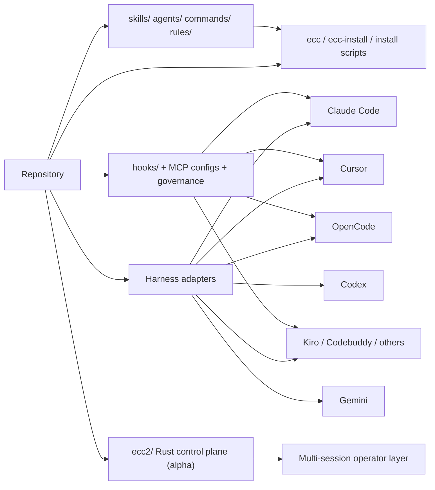

# `everything-claude-code` 저장소 상세 분석

분석 대상: `https://github.com/affaan-m/everything-claude-code`  
분석 시점: `2026-04-10`  
분석 방식: GitHub 공개 저장소 페이지를 확인하고, 원격 저장소를 shallow clone 한 뒤 README, 플러그인 메타데이터, manifest, installer, hook, rule, skill, 테스트/CI 스크립트를 직접 읽어 정리.

## 한 줄 요약

`everything-claude-code`는 Claude Code용 설정 모음집이 아니라, 여러 AI 코딩 하네스에 공통 워크플로를 이식하는 "콘텐츠 카탈로그 + 선택형 설치기 + 런타임 거버넌스 계층"에 가깝다.

## 스냅샷 요약

- GitHub 공개 페이지 기준 (`2026-04-10` 확인):
  - Public repository
  - Star 약 `144k`
  - Fork 약 `22.2k`
  - Branch `17`
  - Tag `61`
  - Commit 표기 `572`
- 현재 패키지 버전: `1.10.0`
- 패키지 이름: `ecc-universal`
- 실행 바이너리:
  - `ecc`
  - `ecc-install`
- 런타임 요구사항: Node.js `>=18`
- 로컬 clone 기준 추적 파일 수: `1,919`
- 카탈로그 검증 스크립트 기준:
  - Agent `47`
  - Skill `181`
  - Command `79`
- 추가 자산 규모:
  - Rule 파일 `89`
  - 문서 파일 `748`
  - 테스트 파일 `80`
  - GitHub Actions 워크플로우 `7`
  - 설치 모듈 `20`
  - 설치 프로필 `5`
  - 기본 번들 MCP 서버 `6`
  - 선택형 MCP 카탈로그 `27`
- `ecc2/` 디렉터리에 Rust 기반 ECC 2.0 alpha 제어 평면이 포함돼 있음

주의:
- Star/fork/branch/tag/commit 수치는 GitHub UI 스냅샷이므로 이후 달라질 수 있다.
- 저장소 카탈로그 숫자(`47/181/79`)와 플러그인 설명 숫자(`38/156/72`)가 다르다. 이는 selective install 및 플러그인 노출 범위 차이로 보이지만, 사용자 입장에서는 숫자 기준점이 여러 개 존재한다는 뜻이기도 하다.

## 이 저장소를 어떻게 봐야 하나

이 레포는 보통 생각하는 "Claude Code 팁/프롬프트 모음"보다 훨씬 넓다. 실제로는 아래 다섯 층이 한 저장소 안에 같이 들어 있다.

1. Claude Code, Codex, Cursor, OpenCode, Gemini 등 여러 하네스에 배포되는 공통 콘텐츠 저장소
2. `ecc` / `ecc-install`를 중심으로 한 선택형 설치 도구
3. skill, agent, rule, command, hook, MCP 설정을 함께 묶는 운영 표면
4. CI, 카탈로그 검증, 문서 동기화를 포함한 품질 관리 체계
5. 장기적으로는 `ecc2/`로 이어지는 상위 제어 평면 실험

즉 이 프로젝트의 본질은 "Claude Code 잘 쓰는 법"이 아니라 "AI 코딩 에이전트를 조직적으로 운영하는 기본 운영체제"에 더 가깝다.

## 저장소의 큰 구조

```text
everything-claude-code/
|
+-- .claude-plugin/            # Claude Code plugin 메타데이터
+-- .codex-plugin/             # Codex plugin 메타데이터
+-- .claude/                   # Claude 관련 하네스 자산
+-- .codex/                    # Codex용 자산
+-- .cursor/                   # Cursor용 자산
+-- .opencode/                 # OpenCode용 자산
+-- .gemini/                   # Gemini용 자산
+-- .kiro/                     # Kiro용 자산
+-- .agents/                   # 공용 agent 배포 자산
+-- agents/                    # agent 문서 원본
+-- skills/                    # canonical skill 카탈로그
+-- commands/                  # legacy command shim 카탈로그
+-- rules/                     # common + 언어별 규율 계층
+-- hooks/                     # 런타임 hook 설정
+-- manifests/                 # selective install 프로필/모듈 정의
+-- mcp-configs/               # MCP 서버 카탈로그
+-- scripts/                   # 설치기, 검증기, catalog, hook 런타임
+-- tests/                     # 검증 스위트
+-- docs/                      # 대규모 운영/사용 문서
+-- ecc2/                      # Rust 기반 ECC 2.0 alpha
+-- AGENTS.md                  # 프로젝트 최상위 운영 계약
+-- CLAUDE.md                  # Claude 관점 진입 문서
+-- install.sh / install.ps1   # 설치 진입점
`-- package.json               # npm 배포 메타데이터
```

## 아키텍처 한눈에 보기



## 핵심 설계 요소

### 1. 콘텐츠 모델이 명확하게 분리돼 있다

이 저장소는 skill, rule, agent, command를 서로 다른 역할로 분리한다.

| 자산 | 역할 | 이 저장소에서의 의미 |
|---|---|---|
| `rules/` | 항상 적용되는 기준 | 공통 원칙 + 언어별 override |
| `skills/` | 상황별 실행 가이드 | 실제 작업 절차의 canonical source |
| `agents/` | 역할 기반 분업 | planner, reviewer, build fixer 같은 전문 페르소나 |
| `commands/` | 진입점/호환성 | README도 "legacy command shims"라고 표현 |
| `hooks/` | 런타임 개입 | 툴 실행 전후 품질/거버넌스 자동화 |

특히 `rules/README.md`가 "Rules tell you what to do; skills tell you how to do it"라는 구조를 명시적으로 설명한다. 이건 단순 문서 정리가 아니라 운영 철학 그 자체다.

### 2. skill-first, command-compatibility 전략이 선명하다

`AGENTS.md`와 README 흐름을 보면 이 프로젝트의 canonical surface는 `skills/`다.  
`commands/`는 사용자 진입과 하위 호환성을 위한 표면이고, 점점 "legacy command shims"로 재정의되고 있다.

이 전략의 장점:

- 워크플로를 스킬 단위로 더 재사용하기 쉽다
- 하네스별 명령 체계 차이를 흡수하기 좋다
- 문서와 설치 자산을 하나의 원본 카탈로그로 묶기 쉽다

반대로 비용도 있다.

- 기존 slash command 사용자에게는 체감 표면이 이중화된다
- README 숫자, 플러그인 숫자, 실제 파일 숫자가 서로 달라 보일 수 있다

### 3. `rules/`는 layered policy system이다

`rules/`는 `common/` + 언어별 디렉터리 구조를 가진다.

- `common/`: coding-style, testing, performance, security, hooks, agents 등 공통 규칙
- 언어별 확장: `typescript/`, `python/`, `golang/`, `rust/`, `swift/`, `web/` 등
- 중국어 번역 계층: `rules/zh/`

이 설계는 CSS처럼 "공통 기본값 + 구체 규칙 override" 모델을 따른다.  
즉 이 프로젝트는 프롬프트를 추가하는 것이 아니라, 에이전트 행동을 위한 정책 계층을 배포한다.

### 4. representative skills가 실제 운영 규율을 드러낸다

대표 skill 두 개만 봐도 방향이 분명하다.

- `skills/tdd-workflow/SKILL.md`
  - 테스트를 먼저 작성하고 RED 상태를 검증한 뒤 구현하도록 강제
  - 80% 이상 coverage
  - Git checkpoint commit까지 워크플로 일부로 규정
- `skills/security-review/SKILL.md`
  - secrets 관리, input validation, SQL injection, auth, XSS 등 보안 체크리스트 제공
  - FAIL/PASS 예제로 실무형 보안 검토를 유도

즉 이 저장소의 강점은 "좋은 조언"보다 "작업 절차를 상세하게 규정한다"는 데 있다.

### 5. hook이 단순 부가 기능이 아니라 런타임 거버넌스 계층이다

`hooks/hooks.json`과 `hooks/README.md`를 보면 hook은 이 프로젝트의 매우 중요한 축이다.

대표 PreToolUse 동작:

- `git --no-verify` 차단
- dev server를 tmux로 유도하거나 자동 실행
- commit 전 staged 파일 품질 검사
- config 완화 시도 차단
- MCP health check
- context compaction 시점 제안

대표 PostToolUse / lifecycle 동작:

- bash audit / cost tracking
- edit 이후 quality gate
- design quality drift 감시
- session summary / pattern extraction / desktop notification

핵심은, 이 레포가 agent에게 "잘 해봐"라고 말하는 대신 실행 표면에 제동장치와 관측 장치를 심어 둔다는 점이다.  
이런 설계는 실제 팀 운영에서는 꽤 강력하다.

### 6. selective install이 이 프로젝트의 제품성 핵심이다

`manifests/install-modules.json`과 `manifests/install-profiles.json`은 저장소 전체를 모듈식 제품으로 분해한다.

확인된 프로필:

- `core`
- `developer`
- `security`
- `research`
- `full`

확인된 모듈 수: `20`

예를 들어 `full` 프로필은 다음 계열을 조합한다.

- core runtime
- framework/language
- database
- workflow quality
- security
- research/content
- operator workflows
- media generation
- orchestration
- swift/apple
- devops/infra
- document processing

즉 저장소 전체를 한 번에 복사하는 구조가 아니라, 기능군 단위로 배포 대상과 비용을 통제하는 구조다.  
이건 "레포가 커졌다"를 넘어서 "카탈로그를 제품으로 만들었다"는 신호다.

### 7. 설치기와 CLI가 실제 운영 도구 역할을 한다

`package.json`과 `scripts/ecc.js`를 보면 `ecc`는 단순 설치 wrapper가 아니다.

확인된 주요 커맨드:

- `install`
- `plan`
- `catalog`
- `list-installed`
- `doctor`
- `repair`
- `status`
- `sessions`
- `session-inspect`
- `uninstall`

즉 사용자는 이 프로젝트를 설치만 하는 것이 아니라, 상태 진단과 수선까지 같은 CLI에서 수행한다.

또 `scripts/install-plan.js` / `scripts/install-apply.js`가 분리돼 있어서:

- 어떤 프로필/모듈이 설치될지 미리 계산할 수 있고
- 하네스별 타겟 적용 로직을 별도로 유지할 수 있다

이런 설계는 대형 catalog 프로젝트에서 꽤 성숙한 편이다.

### 8. multi-harness adapter 저장소로서의 성격이 강하다

최상위에 `.claude`, `.codex`, `.cursor`, `.opencode`, `.gemini`, `.kiro`, `.agents`, `.codebuddy`, `.trae` 등이 함께 존재한다는 점이 중요하다.

이건 단순히 "다양한 에디터를 지원"한다는 수준이 아니다.

- 동일한 workflow 자산을 여러 하네스에 맞게 포장
- 하네스별 플러그인 메타데이터 제공
- 공용 skill/rule catalog는 유지하되 배포 표면은 분기

실제로:

- `.claude-plugin/plugin.json`은 Claude Code용 plugin 메타데이터
- `.codex-plugin/plugin.json`은 Codex용 plugin 메타데이터
- `.mcp.json`은 기본 번들 MCP 서버 6개를 제공
- `mcp-configs/mcp-servers.json`은 선택형 MCP 서버 27개 카탈로그를 제공

즉 ECC는 Claude 전용 제품으로 시작했어도, 현재는 "하네스 간 공통 운영층" 쪽으로 이동한 흔적이 매우 강하다.

### 9. MCP 전략도 두 층으로 나뉜다

기본 번들 `.mcp.json`은 상대적으로 핵심 서버만 담고 있다.

- GitHub
- Context7
- Exa
- Memory
- Playwright
- Sequential Thinking

반면 `mcp-configs/mcp-servers.json`은 훨씬 넓다.

- Jira / GitHub / Confluence
- Firecrawl / Exa / Context7
- Vercel / Railway / Cloudflare / ClickHouse
- Browserbase / browser-use / Playwright
- evalview / token-optimizer / omega-memory / devfleet 등

이 구조는 기본값은 가볍게 두고, 실제 팀 환경에서는 필요할 때만 넓히라는 의도로 읽힌다.

### 10. CI와 catalog 검증이 꽤 강하다

이 레포는 규모가 큰데도 단순 문서 나열로 끝나지 않는다.

`package.json`과 GitHub Actions 기준으로 확인되는 검증 포인트:

- OS matrix: Ubuntu / macOS / Windows
- Node matrix: 18 / 20 / 22
- package manager matrix: npm / pnpm / yarn / bun
- lint + markdownlint
- rules / hooks / skills / commands / manifests 검증
- unicode safety 검사
- personal path 검사
- npm audit high 수준 보안 스캔

특히 `scripts/ci/catalog.js`가 중요하다.

- 실제 `agents/*.md`, `commands/*.md`, `skills/*/SKILL.md`를 세서 카탈로그를 만듦
- README, AGENTS.md, 중국어 문서까지 숫자 일치 여부를 검증
- `--write`로 문서 숫자를 갱신할 수도 있음

실제로 이번 분석에서도 `node scripts/ci/catalog.js --text`를 실행해 `47 / 79 / 181` 수치가 현재 카탈로그와 일치함을 확인했다.

## 플러그인 표면과 저장소 표면의 차이

이 저장소를 읽을 때 가장 헷갈릴 수 있는 부분이다.

### 저장소 카탈로그 기준

- Agent `47`
- Skill `181`
- Command `79`

### Claude plugin 설명 기준

`.claude-plugin/plugin.json` 설명:

- Agent `38`
- Skill `156`
- Legacy command shim `72`

### 해석

이 차이는 대체로 다음 중 하나 또는 복합 요인으로 보인다.

- selective install로 실제 배포되는 기본 표면이 더 좁다
- 특정 하네스에서만 쓰는 자산이 raw repo에 더 많다
- 문서/카탈로그/플러그인 설명 갱신 시점이 완전히 같지 않다

즉 "레포 전체 자산 규모"와 "기본 plugin 노출 규모"를 구분해서 봐야 한다.  
이건 기능적 문제라기보다 대형 catalog 저장소가 가지는 제품화 복잡도다.

## `ecc2/`가 의미하는 것

`ecc2/README.md` 기준, ECC 2.0은 아직 alpha다.

현재 존재하는 것:

- terminal UI dashboard
- SQLite session store
- start / stop / resume
- daemon mode
- observability / risk scoring primitive
- worktree-aware session scaffolding

아직 없는 것:

- 풍부한 multi-agent orchestration
- agent 간 delegation summary
- 시각적 worktree/diff review
- 더 강한 외부 하네스 호환성
- release packaging / installer story

중요한 해석은 이것이다.  
현재 ECC v1 계열이 "콘텐츠와 설치기 중심"이라면, ECC 2.0은 그 위에 올라가는 "운영 제어 평면"을 노리는 중이다.

## 강점

### 1. 범위가 넓지만 구조가 무너지지 않았다

181개 skill과 47개 agent면 보통은 카오스가 되기 쉬운데, 이 레포는 `manifests/`, `catalog`, `rules`, `hooks`, `tests`로 어느 정도 질서를 유지한다.

### 2. 실전 운영에서 필요한 것들이 같이 들어 있다

대부분의 agent toolkit 레포는 프롬프트만 있고, 설치/검증/거버넌스는 비어 있다.  
ECC는 install, repair, doctor, hook runtime, catalog validation까지 같이 가진다.

### 3. 하네스 독립성이 높다

Claude Code에 묶이지 않고 Codex, Cursor, OpenCode, Gemini 등으로 표면을 넓혀 가는 전략이 분명하다.

### 4. 테스트와 정책이 explicit하다

TDD, security, verification, hook governance를 말로만 적지 않고 실제 파일 구조와 runtime에 반영한다.

### 5. 문서와 운영 계약이 풍부하다

README만이 아니라 `AGENTS.md`, `CLAUDE.md`, rules, docs, translated docs까지 살아 있어서 학습 경로가 비교적 명확하다.

## 리스크와 한계

### 1. 범위 확장이 빠른 만큼 카탈로그 인지 비용이 높다

초기 사용자에게는 "무엇을 설치해야 하는지"와 "어떤 숫자가 현재 기준인지"가 바로 이해되지 않을 수 있다.

### 2. 숫자 표면이 여러 개다

`47/181/79`와 `38/156/72`가 공존하는 점은 제품 소개 관점에서 혼선을 줄 수 있다.

### 3. rules 수동 설치 제약이 여전히 남아 있다

README도 Claude Code plugin이 rules를 자동 배포하지 못한다고 명시한다.  
즉 가장 중요한 정책 계층 일부가 여전히 수동 절차에 기대고 있다.

### 4. 문서 동기화 부담이 크다

문서 파일이 700개를 넘고 번역 문서까지 포함돼 있어, 실제 제품 표면과 문서 표면을 계속 일치시키는 비용이 크다.

### 5. ECC 2.0은 아직 방향성이지 완성품이 아니다

장기 비전은 매력적이지만, 현재로서는 alpha scaffold 단계로 보는 것이 맞다.

## 어떤 사용자에게 맞는가

잘 맞는 경우:

- Claude Code를 포함해 여러 agent harness를 함께 운영하는 팀
- TDD, security, review, hook governance를 기본값으로 강제하고 싶은 팀
- 자체 운영 규칙을 갖춘 AI 개발 환경을 만들고 싶은 팀
- 설치/배포/검증 체계까지 포함된 agent toolkit을 찾는 경우

덜 맞는 경우:

- 가볍게 slash command 몇 개만 추가하고 싶은 개인 사용자
- 최소한의 설정만 원하고 policy/hook 개입은 싫어하는 사용자
- 특정 하네스 하나만 아주 얇게 쓰는 환경

## 추천 읽기 순서

1. `README.md`
2. `AGENTS.md`
3. `CLAUDE.md`
4. `.claude-plugin/plugin.json`
5. `.codex-plugin/plugin.json`
6. `manifests/install-profiles.json`
7. `manifests/install-modules.json`
8. `scripts/ecc.js`
9. `scripts/install-plan.js`
10. `scripts/install-apply.js`
11. `hooks/README.md`
12. `hooks/hooks.json`
13. `rules/README.md`
14. `skills/tdd-workflow/SKILL.md`
15. `skills/security-review/SKILL.md`
16. `scripts/ci/catalog.js`
17. `ecc2/README.md`

이 순서로 읽으면 "무엇을 제공하는가 -> 어떻게 설치하는가 -> 어떻게 강제하는가 -> 어디로 가고 있는가"가 자연스럽게 연결된다.

## 최종 평가

`everything-claude-code`는 Claude Code 생태계의 유명 레포이기도 하지만, 실제로는 그보다 더 큰 프로젝트다.  
이 저장소는 skill library, rule system, hook governance, MCP catalog, selective installer, multi-harness adapter, 그리고 차세대 control plane 실험까지 한데 모은 운영 플랫폼이다.

가장 인상적인 점은 규모보다 구조다.  
콘텐츠 양이 많아진 것만으로는 이런 레포가 유지되지 않는다. ECC는 manifest, catalog 검증, hook runtime, CI matrix, profile 기반 설치 같은 장치를 통해 이 거대한 카탈로그를 "제품처럼" 관리하려 한다.

결론적으로, 이 레포는 "Claude Code를 위한 최고의 설정 모음"이라고만 부르면 축소 해석이다.  
더 정확한 표현은, "여러 AI 코딩 하네스에 이식 가능한 실전형 엔지니어링 운영 레이어"다.

## 검증 메모

이번 분석에서 실제로 확인한 항목:

- GitHub 공개 저장소 메타데이터 확인
- 원격 저장소 shallow clone
- README / AGENTS / CLAUDE / plugin metadata / manifests / hooks / rules / representative skills / ECC2 문서 직접 열람
- `node scripts/ci/catalog.js --text` 실행으로 카탈로그 숫자 일치 확인

실행하지 않은 것:

- 전체 테스트 스위트
- `ecc2` Rust 빌드 및 테스트
- 실제 각 하네스별 설치 시뮬레이션
