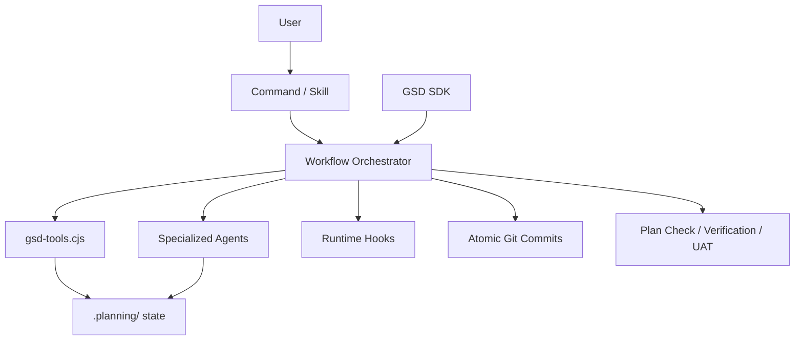

# `get-shit-done` 저장소 상세 분석

분석 대상: `https://github.com/gsd-build/get-shit-done`  
분석 시점: `2026-04-10`  
분석 방식: GitHub 공개 저장소 페이지와 GitHub 메타데이터를 확인하고, 원격 저장소를 shallow clone 한 뒤 `README.md`, `docs/USER-GUIDE.md`, `docs/ARCHITECTURE.md`, `commands/`, `agents/`, `workflows/`, `bin/install.js`, `hooks/`, `sdk/`, `CHANGELOG.md`, CI workflow, 테스트 스위트를 직접 읽고 일부는 실제 실행까지 해 확인했다.

## 한 줄 요약

`get-shit-done`는 Claude Code용 프롬프트 세트가 아니라, **파일 기반 계획 상태 + 얇은 오케스트레이터 + 역할별 에이전트 + 다중 런타임 설치기 + 헤드리스 SDK**를 한 저장소에 담은 AI 개발 운영 계층이다.

## 스냅샷 요약

- GitHub 공개 페이지 기준 (`2026-04-10` 확인):
  - Public repository
  - Star 약 `50k`
  - Fork 약 `4.2k`
  - Open issues `65`
  - Open pull requests `19`
  - Commit 표기 `1,715`
  - 기본 브랜치 `main`
- npm/package 메타데이터:
  - 패키지명 `get-shit-done-cc`
  - 버전 `1.34.2`
  - 라이선스 `MIT`
  - Node.js 요구사항 `>=22.0.0`
- 로컬 clone 기준 확인한 구조:
  - 추적 파일 수 `600`
  - command 파일 `68`
  - workflow markdown `68`
  - agent markdown `24`
  - hook 파일 `9`
  - `docs/` 파일 `63`
  - `get-shit-done/references/` 파일 `36`
  - `get-shit-done/templates/` 파일 `43`
  - `sdk/src` 파일 `45`
  - `tests/` 파일 `137`
  - 루트 `*.test.cjs` 파일 `136`
  - GitHub Actions workflow 파일 `11`
- 지원 표면:
  - README는 Claude Code, OpenCode, Gemini CLI, Kilo, Codex, Copilot, Cursor, Windsurf, Antigravity, Augment, Trae, Cline까지 포괄한다고 설명한다
  - 실제 `install.js`는 Claude/OpenCode/Gemini/Kilo/Codex/Copilot/Antigravity/Cursor/Windsurf/Augment/Trae용 설치 분기는 명확히 보이지만, `--cline` 플래그는 현재 소스와 `--help` 출력에서 확인되지 않았다
- 실제 테스트 실행:
  - `npm test` 실행 성공
  - `2736` tests, `2728` pass, `0` fail, `8` skipped
  - 총 실행 시간 약 `28.96s`

주의:

- GitHub star/fork/issues/PR/commit 수치는 GitHub UI 스냅샷이라 이후 달라질 수 있다.
- 이 레포는 매우 빠르게 진화하고 있어 문서 수치와 실제 코드 트리가 몇 군데 어긋난다. 예를 들어:
  - `docs/AGENTS.md`는 "21 specialized agents"를 말하지만 실제 `agents/` 파일은 `24`개다
  - `docs/ARCHITECTURE.md`는 command total `69`, reference `35`, installer 약 `3,000` lines라고 설명하지만 실제로는 command `68`, reference `36`, `bin/install.js`는 `6,259` lines다
  - README와 다국어 문서는 `--cline` 설치를 설명하지만 현재 `bin/install.js`와 `node bin/install.js --help` 출력에서는 `--cline`를 확인하지 못했다

## 이 저장소를 어떻게 봐야 하나

이 레포를 "slash command 모음"으로만 보면 중심을 놓친다. 실제로는 다음 여섯 층이 함께 작동한다.

1. 다중 AI 코딩 런타임용 배포 시스템
2. `.planning/` 파일 트리를 중심으로 한 상태 저장 시스템
3. `commands -> workflows -> agents` 오케스트레이션 계층
4. `gsd-tools.cjs` 중심의 CLI 커널
5. hooks, 보안 스캔, 품질 게이트 계층
6. `@gsd-build/sdk` 기반의 헤드리스 실행 계층

즉 GSD의 진짜 제품은 "좋은 프롬프트"가 아니라, **AI가 일할 수 있는 운영 절차와 문맥 인프라**다.

## 저장소의 큰 구조

```text
get-shit-done/
|
+-- .github/workflows/         # 테스트, 릴리즈, 보안, PR 게이트
+-- agents/                    # 24 specialized agents
+-- commands/gsd/              # 사용자 진입 command 68개
+-- docs/                      # 아키텍처/가이드/기능 문서 + 로컬라이즈드 문서
+-- get-shit-done/
|   +-- bin/                   # gsd-tools.cjs 및 CLI helper modules
|   +-- contexts/              # context assets
|   +-- references/            # shared reasoning/rules references
|   +-- templates/             # planning artifact templates
|   `-- workflows/             # 실제 오케스트레이션 로직
+-- hooks/                     # runtime hook sources
+-- scripts/                   # build/scan/test helper scripts
+-- sdk/                       # headless TypeScript SDK
+-- tests/                     # 루트 패키지 테스트
+-- bin/install.js             # 초대형 multi-runtime installer
+-- package.json               # npm distribution surface
+-- CHANGELOG.md               # 빠른 변화의 이력
`-- .clinerules                # Cline integration artifact
```

## 이 저장소의 정체성

README의 자기 규정은 아주 분명하다.

- meta-prompting system
- context engineering layer
- spec-driven development system
- context rot 해결
- solo developer + AI builder workflow

이 메시지를 코드로 번역하면 다음과 같다.



즉 GSD는 AI가 코드를 쓰는 순간만 다루지 않는다.  
무엇을 만들지 정하고, 어떤 맥락을 불러오고, 어떻게 검증하고, 어떤 형식으로 다른 런타임에 배포할지까지 묶어서 다룬다.

## 핵심 설계 요소

### 1. `commands/`는 얇고, 진짜 로직은 `workflows/`에 있다

예를 들어 `commands/gsd/help.md`는 거의 래퍼에 가깝다.

- `<objective>`로 "레퍼런스만 출력"을 선언
- 실제 내용은 `@~/.claude/get-shit-done/workflows/help.md`를 참조

`commands/gsd/plan-phase.md`도 마찬가지다.

- frontmatter로 tool, agent, argument-hint만 선언
- 진짜 프로세스는 `get-shit-done/workflows/plan-phase.md`에 위임

즉 command는 사용자-facing API 표면이고, workflow는 orchestration code에 해당한다.

이 구조의 장점은 분명하다.

- command는 짧고 discoverable하다
- workflow는 길고 복잡한 상태 전이를 담을 수 있다
- 다른 런타임으로 설치할 때 command surface만 변환하고 core workflow는 재사용할 수 있다

### 2. workflow와 agent의 책임 분리가 아주 강하다

`get-shit-done/workflows/plan-phase.md`를 보면 orchestrator는:

- phase/context/config를 초기화하고
- 필요 시 research를 돌리고
- `gsd-planner`를 호출하고
- `gsd-plan-checker`로 검증하고
- 최대 3회 revision loop를 관리한다

반면 `agents/gsd-planner.md`는:

- 실제 PLAN 생성
- decision fidelity 유지
- scope reduction 금지
- XML task 구조 생성

`agents/gsd-plan-checker.md`는:

- requirement coverage
- task completeness
- dependency correctness
- key links
- scope sanity
- verification derivation

같은 방식으로 뒤에서 plan을 거꾸로 검증한다.

즉 GSD는 "한 에이전트가 다 한다"가 아니라, **오케스트레이터는 흐름을, 에이전트는 역할별 판단을** 맡는다.

### 3. `.planning/`은 문서 폴더가 아니라 런타임 상태 저장소다

`docs/USER-GUIDE.md`와 `docs/ARCHITECTURE.md`가 반복해서 강조하는 중심은 `.planning/`이다.

핵심 아티팩트:

- `PROJECT.md`
- `REQUIREMENTS.md`
- `ROADMAP.md`
- `STATE.md`
- `config.json`
- `phases/{XX-phase}/XX-CONTEXT.md`
- `XX-RESEARCH.md`
- `XX-YY-PLAN.md`
- `XX-YY-SUMMARY.md`
- `XX-VERIFICATION.md`
- `XX-VALIDATION.md`
- `XX-UI-SPEC.md`
- `XX-UI-REVIEW.md`
- `XX-UAT.md`
- `todos/`, `threads/`, `seeds/`, `debug/`

중요한 점은 이 파일들이 "나중에 참고할 문서"가 아니라, 다음 단계 에이전트가 읽는 **실행 입력**이라는 점이다.

즉 GSD는 파일 기반 상태 저장소를 가진 워크플로 엔진이다.

### 4. Context Engineering이 실제 코드로 구현돼 있다

README는 context rot를 이 프로젝트의 핵심 문제 정의로 둔다.  
이 말이 빈 수사가 아닌 이유는 SDK와 workflow 구현에서 바로 드러난다.

`sdk/src/context-engine.ts`는 phase type별로 어떤 파일을 읽을지 선언적으로 정리한다.

- Execute: `STATE.md`, `config.json`
- Research: `STATE.md`, `ROADMAP.md`, `CONTEXT.md`
- Plan: `STATE.md`, `ROADMAP.md`, `CONTEXT.md`, `RESEARCH.md`, `REQUIREMENTS.md`
- Verify: `STATE.md`, `ROADMAP.md`, `REQUIREMENTS.md`, `PLAN.md`, `SUMMARY.md`

그리고 추가로:

- 현재 milestone만 추출
- 긴 markdown은 heading + 첫 문단 중심으로 truncate
- prompt cache 친화적으로 맥락을 줄임

이건 곧 GSD가 "프롬프트를 잘 쓰자"가 아니라 **어떤 맥락을 언제 얼마나 싣는가**를 별도 엔진으로 취급한다는 뜻이다.

### 5. PLAN은 문서가 아니라 실행 프롬프트다

`agents/gsd-planner.md`의 철학을 한 문장으로 요약하면:

> PLAN.md is the prompt.

이 에이전트는 다음을 강하게 요구한다.

- 2-3 task max
- `<files>`, `<action>`, `<verify>`, `<done>` 필수
- user decision fidelity 유지
- deferred idea 금지
- partial delivery 금지
- phase가 크면 단순 축소 대신 split 제안

README가 XML prompt formatting을 전면에 두는 이유도 여기 있다.

GSD에서 PLAN은 PM 문서가 아니라, executor가 바로 읽고 실행할 수 있는 structured prompt다.

### 6. 설치기 `bin/install.js`가 사실상 두 번째 제품이다

이 저장소에서 가장 인상적인 파일 하나를 꼽으면 `bin/install.js`다.

실측:

- line count `6,259`

이 파일은 단순 복사 스크립트가 아니라:

- runtime 선택
- global/local 설치
- path normalization
- runtime별 tool/frontmatter 변환
- Claude command -> Codex skill 변환
- Codex `config.toml` 생성
- agent `.toml` 생성
- hook 등록
- manifest 작성
- uninstall
- local patch backup

까지 모두 처리한다.

특히 Codex 쪽은 단순 파일 복사가 아니다.

- `skills/gsd-*/SKILL.md` 생성
- `config.toml` 생성
- agent role용 `.toml` 파일 생성
- `codex_hooks` feature 설정

실제 테스트 로그에서도 Codex install e2e가 반복 실행되며, "68 skills 설치 / 24 agent roles 생성"이 검증된다.

즉 이 레포는 source repo이면서 동시에 **multi-runtime transpiler/installer repo**이기도 하다.

### 7. runtime abstraction은 install 시점 변환 전략으로 구현된다

README와 `docs/ARCHITECTURE.md` 모두 여러 런타임 지원을 전면에 내세운다.

실제로 소스에서 명확히 확인되는 설치 분기:

- Claude Code
- OpenCode
- Gemini CLI
- Kilo
- Codex
- Copilot
- Antigravity
- Cursor
- Windsurf
- Augment
- Trae

핵심 아이디어는 "코어 작성은 Claude 스타일로 하고, 배포 시점에 각 런타임 문법으로 변환"이다.

예:

- Claude tools -> Copilot tools 매핑
- Claude skill -> Codex/Cursor/Windsurf/Augment skill 디렉터리 변환
- Claude path -> runtime-specific path replacement
- Claude hooks 이벤트명 -> Gemini 호환 이름

이 설계의 장점은 코어 유지 보수는 한 곳에서 하고, 배포 포맷만 런타임별로 맞출 수 있다는 점이다.  
반대로 리스크는 런타임 수가 늘수록 설치기와 테스트 표면이 폭발적으로 커진다는 점이다.

### 8. hook은 작지만 전략적으로 배치돼 있다

`hooks/`에는 9개 파일이 있다.

- `gsd-check-update.js`
- `gsd-context-monitor.js`
- `gsd-prompt-guard.js`
- `gsd-read-guard.js`
- `gsd-statusline.js`
- `gsd-workflow-guard.js`
- `gsd-session-state.sh`
- `gsd-validate-commit.sh`
- `gsd-phase-boundary.sh`

여기에 `scripts/build-hooks.js`가 붙는다.

이 스크립트는:

- npm publish 전에 hooks를 `dist`로 복사
- JS syntax validation 선행
- 깨진 hook 배포를 막음

즉 GSD는 hook을 "있으면 좋은 장식"이 아니라, 실제 배포 안정성 대상으로 다룬다.

또 hook 역할도 꽤 실전적이다.

- statusline
- context usage warning
- prompt injection advisory
- read-before-edit advisory
- workflow boundary 감지
- commit validation

이건 운영체제 비유로 보면 background daemon에 가깝다.

### 9. 보안과 품질 게이트가 기능이 아니라 기본 설계다

README, `SECURITY.md`, `security-scan.yml`, 여러 테스트 이름을 보면 이 레포는 보안과 품질을 "후처리"로 보지 않는다.

확인된 요소:

- path traversal prevention
- prompt injection detection
- shell argument validation
- schema drift detection
- secure-phase workflow
- prompt/base64/secret scan scripts
- `.planning/`가 PR에 포함되지 않도록 검사
- plan-checker / verifier / UAT / Nyquist validation

`.github/workflows/security-scan.yml`은 PR마다:

- prompt injection scan
- base64 obfuscation scan
- secret scan
- `.planning/` 커밋 금지 검사

를 수행한다.

즉 GSD는 LLM workflow가 가진 취약점 자체를 제품 설계 문제로 다룬다.

### 10. 테스트 구조가 unusually broad하다

이 저장소는 테스트를 단순 unit test 수준에 두지 않는다.

실제 확인한 루트 테스트 파일 이름만 봐도 범위가 넓다.

- installer/runtime 변환: `codex-config`, `cursor-conversion`, `windsurf-install`, `augment-conversion`
- workflow 안정성: `execute-phase-wave`, `worktree-cleanup`, `discuss-mode`, `health-validation`
- 보안: `prompt-injection-scan`, `security-scan`, `schema-drift`, `read-guard`
- 문서/규약: `claude-skills-migration`, `gates-taxonomy`, `workflow-compat`, `hardcoded-paths`
- 운영 리스크: `concurrency-safety`, `locking-bugs-*`, `package-manifest`

루트 패키지는 Node 내장 test runner를 쓴다.

- `scripts/run-tests.cjs`가 `node --test`로 `tests/*.test.cjs` 실행

반면 `sdk/`는 별도 `vitest.config.ts`와 `sdk/package.json`을 갖고 있다.

- root = 운영 레이어 테스트
- sdk = TypeScript library 테스트

실제로 이번 분석 중 `npm test`를 돌려서:

- `2736` tests
- `2728` pass
- `0` fail
- `8` skipped

를 확인했다.

다만 테스트 로그에는 Codex 설치 e2e 도중 다음 경고가 반복적으로 보였다.

- `agents/gsd-debugger.toml`에 unreplaced `.claude` path reference `3`개

이 경고는 현재 suite를 깨진 않았지만, multi-runtime abstraction의 유지보수 난도를 보여주는 좋은 사례다.

### 11. SDK 추가는 이 프로젝트의 방향 전환을 보여준다

`sdk/package.json`을 보면 이 저장소는 더 이상 interactive slash command에만 머물지 않는다.

- 패키지명 `@gsd-build/sdk`
- TypeScript 기반
- `@anthropic-ai/claude-agent-sdk` 의존
- `gsd-sdk` CLI 노출

`sdk/src/index.ts`의 핵심 API:

- `executePlan()`
- `runPhase()`
- `run()`

`sdk/src/phase-runner.ts`는 phase lifecycle을 사실상 상태 머신처럼 다룬다.

- discuss
- research
- plan
- plan-check
- execute
- verify
- advance

즉 GSD는 "사람이 Claude Code 안에서 쓰는 워크플로"에서 한 걸음 더 나아가, **프로그램이 GSD를 호출해 자동 실행하는 플랫폼**으로 확장 중이다.

### 12. 문서화는 강점이지만, 드리프트도 함께 크다

이 레포의 강점 중 하나는 문서가 매우 풍부하다는 점이다.

- `README.md`
- `docs/USER-GUIDE.md`
- `docs/ARCHITECTURE.md`
- `docs/AGENTS.md`
- `docs/FEATURES.md`
- 다국어 문서

하지만 동시에 가장 주의해서 읽어야 하는 이유도 여기 있다.

실제 드리프트 사례:

- `docs/AGENTS.md`: 21 agents 설명 vs 실제 24 files
- `docs/ARCHITECTURE.md`: 69 commands 설명 vs 실제 68 files
- `docs/ARCHITECTURE.md`: installer 약 3000 lines 설명 vs 실제 6259 lines
- README: `--cline` 지원 설명 vs 현재 installer/help 미확인

즉 이 저장소는 문서가 빈약한 프로젝트는 아니지만, **너무 빠르게 커져서 문서가 코드를 완전히 따라잡지 못하는 프로젝트**에 가깝다.

## 강점

### 1. context engineering을 추상 개념이 아니라 시스템 설계로 구현했다

artifact selection, truncation, milestone narrowing, file-based state가 모두 실제 코드에 내려와 있다.

### 2. orchestrator/agent 분리가 선명하다

workflow는 상태 전이와 통합을, agent는 좁고 깊은 역할 수행을 맡는다. 구조가 크지만 이유 없는 중복은 적다.

### 3. multi-runtime 전략이 매우 공격적이면서도 체계적이다

소스를 한 번 쓰고 install 시점에 여러 런타임 형식으로 변환하는 방식은 유지보수 비용이 크지만, 제품 관점에서는 매우 강력하다.

### 4. 테스트와 보안 스캔이 실제 운영 수준이다

단순 happy path가 아니라 path traversal, prompt injection, schema drift, runtime conversion, worktree cleanup 같은 실전 리스크를 테스트한다.

### 5. SDK 덕분에 interactive workflow를 넘어설 수 있다

slash command 사용 경험을 library/CLI로 추상화해 자동화 파이프라인으로 확장하려는 방향이 분명하다.

## 리스크와 한계

### 1. 시스템이 커질수록 "경량 도구"라는 자기 설명과 멀어진다

README는 lightweight를 내세우지만, 실제 저장소는 installer 6000+ lines, command/workflow 68개씩, tests 2700+ 케이스 규모다.  
사용자 경험은 단순해도 내부 시스템은 결코 가볍지 않다.

### 2. 문서 드리프트가 눈에 띈다

카운트, installer 규모, runtime 표면 설명이 현재 코드와 어긋나는 부분이 있다.  
읽을 때는 항상 최신 기준을 코드와 테스트 쪽에서 다시 확인해야 한다.

### 3. multi-runtime 약속이 유지보수 표면을 크게 늘린다

Claude, Codex, Copilot, Cursor, Windsurf, Augment, Trae 등으로 갈수록:

- path replacement
- tool mapping
- frontmatter translation
- hook compatibility
- uninstall/manifest

모두 runtime별로 보정해야 한다.

이번 테스트 로그의 Codex path warning도 그 부담이 완전히 사라지지 않았음을 보여준다.

### 4. 방법론의 색이 강하다

이 레포는 자유로운 즉흥 코딩보다:

- discuss
- research
- plan
- execute
- verify
- UAT
- ship

의 절차를 강하게 밀어준다.

즉 "바로 만들고 보자"를 선호하는 사용자에겐 과할 수 있다.

### 5. 런타임별 실제 지원 범위는 README만 믿기 어렵다

특히 Cline 관련 설명은 현재 README/문서와 installer 소스가 같은 그림을 그리고 있지 않다.  
이런 종류의 mismatch는 도입 전에 직접 설치 경로를 검증해야 한다는 뜻이다.

## 어떤 사용자에게 맞는가

잘 맞는 경우:

- AI 코딩을 프로젝트 운영 절차까지 포함해 표준화하고 싶은 사용자
- solo developer지만 계획/검증/상태 추적을 포기하고 싶지 않은 사용자
- Claude Code 외 다른 런타임까지 한 체계로 운영하고 싶은 팀
- 파일 기반 planning artifacts를 git 히스토리와 함께 남기고 싶은 환경
- 나중에 SDK 기반 자동화까지 확장하고 싶은 사용자

덜 맞는 경우:

- 단순한 커스텀 command 몇 개만 원할 때
- 문서보다 즉시 구현 속도를 더 중시할 때
- 여러 런타임 호환성보다 한 도구에 깊게 맞춘 최적화가 중요할 때
- 강한 워크플로보다 자유도가 더 중요한 개인 사용 사례

## 추천 읽기 순서

1. `README.md`
2. `docs/USER-GUIDE.md`
3. `docs/ARCHITECTURE.md`
4. `package.json`
5. `bin/install.js`
6. `commands/gsd/plan-phase.md`
7. `get-shit-done/workflows/plan-phase.md`
8. `agents/gsd-planner.md`
9. `agents/gsd-plan-checker.md`
10. `get-shit-done/bin/gsd-tools.cjs`
11. `hooks/gsd-context-monitor.js`
12. `sdk/src/index.ts`
13. `sdk/src/phase-runner.ts`
14. `.github/workflows/test.yml`
15. `CHANGELOG.md`

이 순서로 읽으면 "제품 메시지 -> 운영 구조 -> 실제 실행 엔진 -> 배포/검증 표면"이 자연스럽게 이어진다.

## 최종 평가

`get-shit-done`는 더 이상 Claude Code 주변의 생산성 스크립트 모음이 아니다.

지금의 형태는:

- planning state store
- workflow engine
- agent role library
- runtime transpiler/installer
- security/quality harness
- headless SDK

를 한 저장소에 합친 **AI 개발 운영 프레임워크**에 가깝다.

가장 인상적인 점은 세 가지다.

1. `.planning/`을 중심으로 한 파일 기반 상태 설계가 일관되다
2. `commands -> workflows -> agents` 분리가 분명하다
3. multi-runtime 지원을 진짜 설치/테스트 코드로 밀어붙였다

반대로 가장 주의할 점도 분명하다.

1. 내부 복잡도는 전혀 가볍지 않다
2. 문서와 코드 사이 드리프트가 있다
3. runtime abstraction은 강력하지만 유지보수 비용이 매우 크다

정리하면, GSD는 "AI가 대신 코딩하게 해주는 도구"라기보다 **AI가 코딩하는 과정을 설계하고 통제하는 시스템**으로 보는 편이 맞다.

## 검증 메모

이번 분석에서 실제로 확인한 항목:

- GitHub 공개 저장소 메타데이터와 저장소 페이지
- GitHub repository metadata (`gsd-build/get-shit-done`)
- 원격 저장소 shallow clone
- `README.md`, `docs/USER-GUIDE.md`, `docs/ARCHITECTURE.md`, `docs/AGENTS.md`, `CHANGELOG.md`
- `package.json`, `sdk/package.json`
- `commands/gsd/help.md`, `commands/gsd/plan-phase.md`
- `get-shit-done/workflows/plan-phase.md`
- `agents/gsd-planner.md`, `agents/gsd-plan-checker.md`
- `bin/install.js`, `scripts/build-hooks.js`, `scripts/run-tests.cjs`
- `hooks/` 파일 목록
- `.github/workflows/test.yml`, `.github/workflows/security-scan.yml`
- `sdk/src/index.ts`, `sdk/src/phase-runner.ts`, `sdk/src/context-engine.ts`
- `npm test` 실제 실행 결과

직접 실행하지 않은 것:

- interactive installer를 각 런타임에 수동 설치
- README가 주장하는 모든 런타임 경로를 실제로 하나씩 설치 검증
- SDK를 별도 build/publish 흐름으로 패키징 실행
