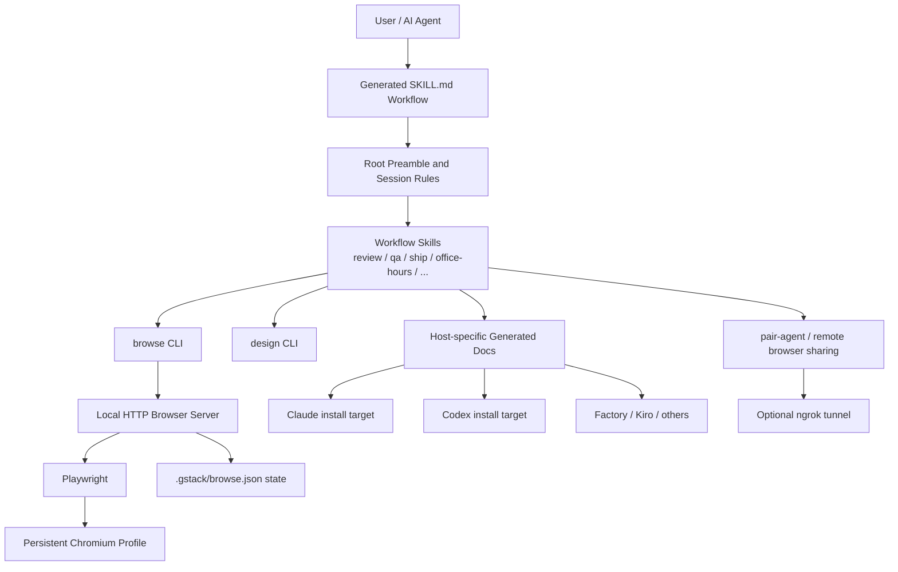

# gstack 저장소 상세 분석

- 분석 대상: `garrytan/gstack`
- 분석 시점: 2026-04-10 (KST)
- 분석 방식: GitHub 저장소 메타데이터 확인, 저장소 shallow clone, 핵심 문서/스크립트/소스 읽기
- 검증 한계: 이 환경에는 `bun` 이 없어 `bun test`, `bun run build`, `./setup` 실행 검증은 하지 못했다

## 한 줄 요약

`gstack` 는 단순한 Claude Code 프롬프트 모음이 아니라, **생성형 SKILL.md 기반의 역할 조직 + Bun/Playwright 기반 지속형 브라우저 런타임 + 다중 호스트 설치/문서 생성기 + 원격 페어 에이전트 브라우저 공유 계층**을 하나의 배포물로 묶은, 매우 강한 의견을 가진 AI 엔지니어링 워크플로 스택이다.

## 저장소 스냅샷

### GitHub 기준 스냅샷

2026-04-10 에 GitHub UI 에서 확인한 값은 대략 다음과 같다.

| 항목 | 값 |
| --- | --- |
| 공개 여부 | Public |
| 기본 브랜치 | `main` |
| Stars | 약 9.5k |
| Forks | 약 453 |
| Open Issues | 32 |
| Pull Requests | 50 |
| Commits | 1,649 |
| Branches | 21 |
| Tags | 122 |

### 코드베이스 기준 스냅샷

| 항목 | 값 |
| --- | --- |
| 패키지명 | `gstack` |
| 버전 | `0.16.2.0` |
| 라이선스 | MIT |
| 런타임 요구사항 | Claude Code, Git, Bun >= 1.0, Windows 에서는 Node.js 추가 |
| tracked files | 417 |
| 최상위 skill 디렉터리 | 36개 |
| `SKILL.md` 파일 | 37개 (루트 포함) |
| `browse/src` 파일 수 | 28 |
| `design/src` 파일 수 | 16 |
| `browse` + `design` TS 총 라인 수 | 15,524 |
| 테스트 파일 수 | 66 |
| 문서 파일 수 | 17 |
| 스크립트 파일 수 | 31 |
| GitHub Actions 워크플로 | 5 |

### 최근 릴리스 흐름

`CHANGELOG.md` 기준으로 최근 릴리스 방향은 꽤 분명하다.

- `0.16.2.0` (2026-04-09): office-hours 메모리, builder profile, 리소스 dedup 등 워크플로 정교화
- `0.16.1.0` (2026-04-08): cookie picker auth token 노출 수정
- `0.16.0.0` (2026-04-07): browser data platform, download/scrape/archive, 응답 본문 캡처, `/file` 엔드포인트
- `0.15.15.0` 전후: 대규모 보안 회귀 테스트, cookie redaction, path validation 강화
- `0.15.13.0`: Team Mode, `gstack-team-init`, SessionStart 자동 업데이트 훅
- `0.15.12.0`: 4-layer prompt injection defense

즉, 최근 흐름은 크게 세 갈래다.

1. 브라우저를 더 운영형 데이터 플랫폼으로 확장
2. 다중 사용자/팀 워크플로 강화
3. 보안 방어선과 회귀 테스트 지속 강화

## 이 저장소를 어떻게 봐야 하나

이 저장소는 아래 네 층으로 이해하면 가장 잘 읽힌다.

1. **워크플로 스킬 계층**: `/review`, `/qa`, `/ship`, `/office-hours` 같은 역할 기반 워크플로
2. **브라우저 런타임 계층**: `browse` 바이너리와 지속형 Chromium 데몬
3. **호스트/생성 계층**: Claude/Codex/Factory/Kiro/OpenClaw 등으로 스킬 문서를 변환하고 배치하는 생성기
4. **보조 운영 계층**: 팀 모드, 업그레이드, 텔레메트리, 학습 기록, 체크포인트, 릴리스/회고 자동화

즉, 이 프로젝트의 핵심은 "좋은 프롬프트를 많이 제공한다"가 아니라, **AI 에이전트가 실제 제품 개발 조직처럼 움직이게 만드는 운영체제를 제공한다**는 데 있다.

## 최상위 구조

최상위 디렉터리는 다음처럼 묶어 볼 수 있다.

### 역할/워크플로 스킬

`office-hours`, `plan-ceo-review`, `plan-eng-review`, `plan-design-review`, `plan-devex-review`, `review`, `investigate`, `qa`, `qa-only`, `ship`, `land-and-deploy`, `retro`, `benchmark`, `document-release`, `canary`, `cso` 등

### 브라우저 및 디자인 엔진

`browse`, `design`, `open-gstack-browser`, `setup-browser-cookies`, `design-html`, `design-review`, `design-shotgun`, `design-consultation`

### 안전장치/운영 보조

`careful`, `guard`, `freeze`, `unfreeze`, `checkpoint`, `health`, `learn`, `gstack-upgrade`, `setup-deploy`

### 호스트/설치/생성 관련

`hosts`, `scripts`, `codex`, `extension`, `pair-agent`, `openclaw`, `agents`, `docs`

## 아키텍처 요약

이 구조에서 기술적으로 가장 중요한 축은 `browse` 이고, 제품적으로 가장 중요한 축은 루트 `SKILL.md` 와 각 역할별 `SKILL.md` 생성 파이프라인이다.

## 핵심 설계 포인트

### 1. 사실상 모든 것이 생성된 SKILL.md 시스템 위에 올라가 있다

`AGENTS.md` 와 `ARCHITECTURE.md` 를 보면 이 저장소의 기본 철학은 "복잡한 것은 브라우저 런타임이 맡고, 나머지는 Markdown 으로 구성한다"에 가깝다.  
실제로 루트와 각 역할 디렉터리 아래의 `SKILL.md` 는 템플릿에서 생성되며, 소스 오브 트루스는 템플릿과 생성 스크립트다.

이 접근의 장점:

- Claude/Codex/Factory 등 호스트별 문서 차이를 코드로 생성 가능
- 스킬 문서 형식을 일관되게 유지 가능
- CI 에서 문서 freshness 를 검증 가능

이 접근의 비용:

- 생성 파이프라인을 모르면 저장소가 과하게 난잡해 보일 수 있음
- 실제 동작과 README/보조 문서 간 드리프트가 생기기 쉬움

## 2. 루트 `SKILL.md` 는 단순 소개문이 아니라 런타임 정책 레이어다

루트 `SKILL.md` 는 다음을 포함한다.

- 업데이트 체크
- 세션 트래킹
- 텔레메트리 안내
- proactive 설정
- 라우팅 규칙 안내
- learnings / timeline 로깅
- Boil the Lake 철학 주입
- vendored 설치 마이그레이션 안내

즉, 사용자가 `/review` 같은 개별 스킬을 쓰기 전에 이미 **gstack 식 작업 방식**에 들어오게 만든다.

이건 강력한 차별점이기도 하지만 동시에 리스크이기도 하다.

- 장점: 품질과 일관성을 끌어올리기 쉽다
- 단점: 매우 의견이 강하고, 일부 설정은 파일 시스템과 사용자 작업 흐름에 실제 영향을 준다

특히 `~/.gstack` 상태 파일, 세션 기록, 구성 파일 갱신 유도 등은 "단순 프롬프트 팩" 을 기대한 사용자에게는 꽤 무겁게 느껴질 수 있다.

## 3. 기술적으로 가장 가치가 큰 부분은 지속형 브라우저 데몬이다

`ARCHITECTURE.md` 와 `BROWSER.md`, `browse/src` 를 보면 `gstack` 의 진짜 엔진은 `browse` 다.

핵심 구조는 다음과 같다.

- CLI 바이너리가 로컬 HTTP 서버에 명령을 전달
- 서버는 Bun `serve` 와 Playwright 로 동작
- Chromium 프로필과 탭 상태를 지속
- 상태는 `.gstack/browse.json` 에 원자적으로 저장
- 첫 호출은 느리지만 이후 호출은 매우 빠르게 유지

저장소가 굳이 Bun 을 고집하는 이유도 여기서 드러난다.

- 컴파일 가능한 단일 바이너리 배포
- TypeScript 런타임 일체화
- 내장 HTTP 서버
- SQLite 등 내장 기능 활용

README 만 보면 스킬 팩처럼 보이지만, 실제로는 **Playwright 를 감싼 전용 브라우저 제품**에 더 가깝다.

## 4. 브라우저 명령 체계는 생각보다 훨씬 넓다

`browse/src/commands.ts` 기준으로 명령은 아래처럼 분류된다.

| 분류 | 개수 | 예시 |
| --- | --- | --- |
| READ | 18 | `text`, `html`, `links`, `forms`, `console`, `network`, `media`, `data` |
| WRITE | 24 | `goto`, `click`, `fill`, `upload`, `cookie-import`, `download`, `scrape`, `archive` |
| META | 22 | `tabs`, `status`, `restart`, `snapshot`, `handoff`, `resume`, `connect`, `watch`, `frame` |
| 총합 | 64 | 단순 QA 를 넘는 운영형 브라우저 인터페이스 |

여기서 중요한 건 이 브라우저가 단순 캡처 도구가 아니라는 점이다.

- 네트워크 응답 본문 캡처
- 다운로드/아카이브/스크레이프
- 다중 탭 상태 관리
- 원격 handoff / resume
- responsive / diff / watch

즉, "사이트를 읽어주는 브라우저" 가 아니라 **에이전트용 상태 유지형 브라우저 API** 다.

## 5. 접근성 스냅샷 기반 참조 시스템이 핵심 UX 다

`ARCHITECTURE.md` 에서 특히 인상적인 부분은 ref 시스템이다.

- `snapshot -i` 로 접근성 스냅샷 기반의 `@e` 참조 생성
- DOM 을 직접 변형하지 않고 Playwright Locator 를 사용
- 탐색 후 ref stale 여부 확인
- 클릭 가능한 비-ARIA 요소를 위해 `@c` 계열 인터랙티브 참조 제공

이 설계는 LLM 이 브라우저를 다룰 때 흔히 생기는 문제를 줄인다.

- DOM 이 바뀌면 선택자가 깨지는 문제
- 브라우저 상태와 문맥이 불안정해지는 문제
- 시각 좌표 기반 상호작용의 재현성 부족

즉, gstack 의 브라우저는 기능 수보다도 **LLM 친화적인 조작 추상화** 때문에 가치가 크다.

## 6. 보안은 이 저장소에서 매우 높은 우선순위를 차지한다

보안 관련 단서는 여러 곳에서 반복된다.

- localhost 전용 서버
- bearer token 인증
- scoped token / one-time setup key
- `.gstack/browse.json` 0600 권한
- 경로 검증과 path traversal 방어
- 쿠키 값 로깅 금지
- prompt injection 대응용 untrusted content wrapping
- IPv6 ULA 차단, CSS validation, token health, cookie redaction 관련 변경 이력

`CHANGELOG.md` 의 최근 버전들만 봐도 보안 투자 강도가 높다.

- `0.15.7.0`: Security wave 1
- `0.15.12.0`: 4-layer prompt injection defense
- `0.15.15.0`: 대규모 보안 회귀 테스트와 추가 방어
- `0.16.1.0`: cookie picker auth token 노출 수정, CVSS 7.8 언급

테스트 디렉터리에도 `adversarial-security`, `path validation`, `server-auth`, `token-registry`, `url-validation` 같은 보안 중심 테스트가 다수 있다.

결론적으로 이 저장소는 "강한 기능" 을 내세우면서도, 브라우저/쿠키/원격 접근이 가져오는 위험을 꽤 진지하게 다루고 있다.

## 7. 원격 페어 에이전트 브라우저 공유는 매우 강력한 확장 포인트다

`docs/REMOTE_BROWSER_ACCESS.md` 와 `pair-agent` 관련 문서를 보면, 이 프로젝트는 브라우저를 로컬 도구에만 묶어두지 않는다.

- 루트 토큰
- 5분짜리 one-time setup key
- 24시간 세션 토큰
- 탭 단위 격리
- 원격 에이전트 연결
- 필요시 ngrok 터널링

이 기능은 특히 다음에 강하다.

- 로컬에서 로그인된 브라우저 상태를 다른 AI 세션에 재사용
- 장시간 조사/QA 작업을 원격 에이전트로 분리
- 브라우저를 shared infrastructure 로 취급

여기까지 오면 `gstack` 는 개인 스킬 모음이 아니라 **브라우저 기반 AI 작업 인프라** 로 보는 편이 정확하다.

## 8. 디자인 계층은 별도 제품처럼 분리되어 있다

`design/src/cli.ts` 와 `DESIGN.md` 를 보면 `design` 은 `browse` 와 성격이 다르다.

- `browse`: 상태 유지형 데몬
- `design`: 호출할 때마다 실행되는 stateless CLI

`design` CLI 는 `generate`, `check`, `compare`, `variants`, `iterate`, `diff`, `verify`, `evolve`, `gallery`, `serve` 등을 지원한다.  
여기에 `/design-consultation`, `/design-shotgun`, `/design-html`, `/design-review` 같은 상위 스킬이 얹힌다.

즉, 제품 개발 흐름 안에서 "브라우저 QA" 와 "디자인 생성/비교" 를 별도 엔진으로 운영한다.

## 9. 호스트 어댑터 구조는 잘 설계되어 있지만, 일부는 아직 문서보다 구현이 덜 정리돼 있다

`hosts/index.ts` 에는 다음 호스트 설정이 등록되어 있다.

- `claude`
- `codex`
- `factory`
- `kiro`
- `opencode`
- `slate`
- `cursor`
- `openclaw`

또 `docs/ADDING_A_HOST.md` 는 새 호스트 추가가 거의 선언형이라고 설명한다.  
하지만 `setup` 스크립트가 실제로 허용하는 `--host` 값은 다음에 가깝다.

- `claude`
- `codex`
- `kiro`
- `factory`
- `auto`
- `openclaw` 은 별도 안내 후 종료

즉, 저장소 내부에는 host config 기반 멀티 호스트 설계가 이미 존재하지만, **설치 UX 와 README 설명은 아직 완전히 수렴하지 않았다.**

이건 프로젝트가 빠르게 확장되면서 생긴 흔적으로 보인다.

## 10. 테스트와 CI 는 취미 프로젝트 수준을 이미 넘어섰다

`package.json`, `test/`, `browse/test/`, `.github/workflows` 를 보면 검증 체계가 꽤 본격적이다.

### 로컬 테스트 층

- 정적/단위 테스트
- browse 관련 세부 테스트
- skill 문서 생성 검증
- host config 검증
- telemetry / learnings / routing / team mode 검증

### 고비용 E2E / 평가 층

- `skill-e2e-*`
- `skill-llm-eval`
- `codex-e2e`
- `gemini-e2e`
- workflow gate / periodic suites

### CI 층

- `skill-docs.yml`: 생성 문서 freshness 체크
- `evals.yml`: 12개 평가 스위트 매트릭스
- `ci-image.yml`: 이미지 빌드
- `actionlint`

특히 평가 파이프라인이 "문서가 있나" 수준이 아니라, 실제 AI 워크플로가 기대대로 동작하는지 점검하는 쪽으로 설계되어 있다.

다만 외부 기여자 입장에서는 이 검증 체계를 전부 재현하기 어렵다.

- `bun` 필요
- 일부는 유료 API / 비밀값 필요
- 실행 시간이 길다

즉, 내부적으로는 강하지만 외부 진입장벽은 높다.

## 11. 철학 문서가 실제 제품 일부다

`ETHOS.md` 는 단순 문화 문서가 아니다.  
`Boil the Lake`, `Search Before Building`, `User Sovereignty`, `Build for Yourself` 같은 원칙이 스킬 프리앰블과 작업 방식에 직접 주입된다.

이건 `gstack` 의 큰 특징이다.

- 장점: 의사결정이 빠르고 결과물이 일관된다
- 단점: 사용자가 이 철학에 동의하지 않으면 도구 전체가 과하게 개입적으로 느껴질 수 있다

즉, 이 저장소는 중립적인 툴킷보다 **방법론이 내장된 제품**에 가깝다.

## 문서와 구현 사이의 드리프트

이 저장소는 문서가 풍부하지만, 빠르게 움직이는 만큼 일부 어긋남도 있다.

### 1. README 의 "23 specialists and 8 power tools"

README 는 이렇게 설명하지만, 실제 저장소에는 루트 포함 `SKILL.md` 37개, 최상위 skill 디렉터리 36개가 있다.  
즉, 마케팅 카피가 현재 구조를 정확히 반영하지는 않는다.

### 2. README 의 호스트 지원 범위 vs `setup` 구현

README 는 여러 AI 코딩 에이전트와의 동작을 폭넓게 말하지만, `setup` 이 즉시 지원하는 host 인자는 더 좁다.

### 3. `AGENTS.md` 의 일부 용어가 현재 구조와 다르다

예를 들어 `/debug` 라는 명칭이 나오지만 현재 실제 스킬은 `investigate` 다.  
또 skill 경로 표기도 현재 구조와 완전히 일치하지 않는 부분이 있다.

### 4. 일부 설계 문서는 과거 전환기의 흔적이 남아 있다

예를 들어 Slate 관련 문서는 과거에는 막혀 있던 host refactor 를 전제로 설명하는데, 현재는 host config 체계가 이미 들어와 있다.

이 드리프트는 치명적인 수준은 아니지만, 외부 사용자가 빠르게 이해하려면 README 만 보지 말고 실제 코드/스크립트까지 읽는 편이 낫다.

## 이 저장소의 강점

### 1. 브라우저가 진짜다

대부분의 "AI coding workflow" 저장소는 프롬프트 품질에 의존한다.  
`gstack` 는 여기에 지속형 브라우저 엔진을 붙여 실제 관찰/검증/조사 능력을 확보했다.

### 2. 워크플로 범위가 매우 넓다

기획, CEO 리뷰, 엔지니어링 리뷰, 디자인 리뷰, QA, 배포, 릴리즈 문서화, 회고까지 한 흐름으로 이어진다.

### 3. 보안과 운영 성숙도가 높다

브라우저/쿠키/원격 연결이라는 위험한 영역을 다루면서도 보안 패치, 회귀 테스트, scoped token 설계가 분명하다.

### 4. 호스트 확장성이 좋다

Claude 전용에서 멈추지 않고 Codex/OpenClaw/기타 호스트로 넓히려는 구조가 이미 있다.

### 5. 문서 생성과 검증 자동화가 잘 돼 있다

템플릿 기반 생성, freshness 검사, host-specific output 생성은 장기적으로 유지보수에 유리하다.

## 이 저장소의 리스크

### 1. 의견이 매우 강하다

철학, 프리앰블, 세션 규칙, 텔레메트리, 학습 기록, 구성 변경 유도가 모두 포함되어 있어 "가벼운 툴" 이 아니다.

### 2. 구조 복잡도가 높다

스킬, 템플릿, 생성기, 브라우저 서버, 호스트 어댑터, 원격 연결, 디자인 CLI 가 얽혀 있어 처음 들어오는 사람이 구조를 한 번에 잡기 어렵다.

### 3. 런타임 의존성이 분명하다

Bun, Playwright/Chromium, 호스트별 설치 경로, 일부 고비용 평가 환경이 필요하다.

### 4. 문서 드리프트가 이미 보인다

빠르게 발전하는 프로젝트의 자연스러운 현상이지만, 외부 사용자는 "README 기준" 으로 이해하면 오해할 수 있다.

### 5. 민감한 데이터 취급 범위가 넓다

브라우저 세션, 쿠키, 원격 브라우저 공유를 다루므로 신뢰 경계 검토가 필요하다.

## 어떤 사용자에게 맞는가

아래 사용자에게 특히 잘 맞는다.

- Claude Code 를 중심으로 실제 제품을 빠르게 만드는 창업자/소수 팀
- 브라우저 QA 와 조사 자동화가 절실한 사용자
- 의견이 강한 개발 방법론을 받아들일 의향이 있는 사용자
- 설치와 런타임 복잡도를 감수하고 높은 레버리지를 얻고 싶은 사용자

반대로 아래 사용자에게는 덜 맞을 수 있다.

- 단순 프롬프트 팩만 원하는 사용자
- Bun/브라우저 바이너리 의존성을 피하고 싶은 환경
- 정책/텔레메트리/세션 훅에 민감한 조직
- 호스트별 설치/생성 구조를 직접 검토할 시간 여유가 없는 사용자

## 추천 읽기 순서

이 저장소를 실제로 파악하려면 아래 순서가 좋다.

1. `README.md`
2. `AGENTS.md`
3. `ARCHITECTURE.md`
4. `BROWSER.md`
5. 루트 `SKILL.md`
6. `docs/skills.md`
7. `setup`
8. `scripts/gen-skill-docs.ts`
9. `hosts/index.ts`
10. `hosts/codex.ts`
11. `browse/src/commands.ts`
12. `browse/src/server.ts`
13. `docs/REMOTE_BROWSER_ACCESS.md`
14. `design/src/cli.ts`
15. `ETHOS.md`
16. `CHANGELOG.md`

## 최종 평가

`gstack` 는 "Claude Code 용 스킬 모음" 이라는 설명만으로는 전혀 부족하다.  
실제로는 다음 네 가지를 결합한 저장소다.

1. 역할 기반 AI 엔지니어링 조직 모델
2. 지속형 브라우저 런타임
3. 호스트별 생성/설치 파이프라인
4. 강한 제품 철학과 운영 규칙

이 조합 덕분에 레버리지는 크다. 다만 그만큼 사용자가 받아들여야 하는 정책과 복잡도도 크다.  
그래서 `gstack` 를 평가할 때는 "프롬프트 품질" 보다 **브라우저 제품성, 생성 파이프라인, 보안 태도, 방법론의 강도**를 중심에 두고 보는 게 맞다.

## 검증 메모

- GitHub 메타데이터와 저장소 구조를 확인했다
- 저장소를 shallow clone 해서 핵심 파일을 읽었다
- `README.md`, `AGENTS.md`, `ARCHITECTURE.md`, `BROWSER.md`, `ETHOS.md`, `package.json`, `CHANGELOG.md`, `setup`, `hosts/*`, `browse/src/*`, `design/src/cli.ts`, `docs/*`, `.github/workflows/*` 를 중심으로 검토했다
- 이 환경에는 `bun` 이 없어 테스트와 빌드 실행 검증은 하지 못했다
