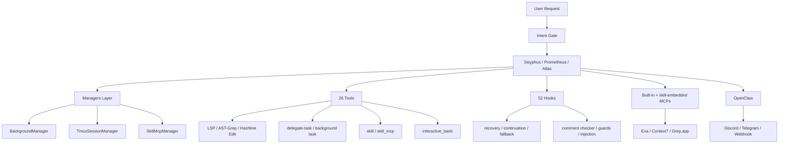

# `oh-my-openagent` 저장소 상세 분석

분석 대상: `https://github.com/code-yeongyu/oh-my-openagent`  
분석 시점: `2026-04-10`  
분석 방식: GitHub 공개 저장소 페이지를 확인하고, 원격 저장소를 shallow clone 한 뒤 README, AGENTS 문서, 설치 가이드, 핵심 소스, CLI, 훅/툴/에이전트 계층을 직접 읽어 정리.

## 한 줄 요약

`oh-my-openagent`는 OpenCode용 플러그인이지만, 실제 성격은 "다중 모델 오케스트레이션 + 배경 에이전트 + 해시 기반 편집 + Claude Code 호환 계층"을 묶은 AI 개발 하네스에 가깝다.

## 스냅샷 요약

- GitHub 공개 페이지 기준 (`2026-04-10` 확인):
  - Public repository
  - Star 약 `50k`
  - Fork 약 `4k`
  - Open issues `266`
  - Open pull requests `195`
  - Commit 표기 `4,814`
  - 기본 작업 브랜치: `dev`
- 현재 npm 패키지 이름: `oh-my-opencode`
- 현재 패키지 버전: `3.16.0`
- 저장소/플러그인 전환 상태:
  - 저장소 path와 plugin entry는 `oh-my-openagent`
  - published package / binary name은 여전히 `oh-my-opencode`
  - 구/신 basename 설정 파일을 모두 인식하는 호환 계층 유지
- 라이선스: `SUL-1.0`  
  - 일반적인 MIT/Apache 계열과 달리 상업적 재배포에 제한이 있음
- 로컬 clone 기준:
  - 추적 파일 수 `1,883`
  - `src/` TS/JS 파일 수 `1,663`
  - repo-wide 테스트 파일 수(`*.test.*`, `*.spec.*`) `523`
  - `docs/` 파일 수 `15`
  - GitHub Actions 워크플로우 `7`
  - 플랫폼별 패키지 디렉터리 `11`
  - `.opencode/` 파일 수 `78`
  - 루트 README 언어판 `5`개
- 생성된 `AGENTS.md` 기준 내부 핵심 숫자:
  - Agent `11`
  - Lifecycle hook `52`
  - Tool `26`
- 설치 가이드 기준:
  - 설치 후 CLI 실행에는 별도 Bun/Node 런타임이 필요 없는 플랫폼별 standalone binary 제공

주의:
- GitHub star/fork/issues/PR/commit 수치는 UI 스냅샷이라 이후 달라질 수 있다.
- README는 일부 수치를 둥글게 표현한다. 예를 들어 README는 "25+ hooks"라고 쓰지만, 생성된 `AGENTS.md`는 `52 lifecycle hooks`로 더 구체적이다.

## 이 저장소를 어떻게 봐야 하나

이 레포를 단순 "OpenCode 플러그인"으로만 보면 절반만 보게 된다. 실제로는 다음이 겹쳐 있다.

1. OpenCode plugin 제품
2. `oh-my-opencode`라는 npm/CLI 도구
3. 다중 모델 오케스트레이션 런타임
4. 해시 기반 편집, LSP, AST 도구를 갖춘 하네스 확장 계층
5. Claude Code 자산을 가져오는 호환 계층
6. Discord/Telegram/webhook까지 연결되는 외부 운영 브리지

즉 "OpenCode를 위한 설정팩"이 아니라, "OpenCode를 중심으로 AI 개발 환경 전체를 더 강한 하네스로 재구성하는 프로젝트"라고 보는 편이 정확하다.

## 저장소의 큰 구조

```text
oh-my-openagent/
|
+-- .opencode/                  # 사용자-facing command/skill/background state
+-- .sisyphus/                  # 내부 운영 규칙/플랜/노트용 작업 공간
+-- src/                        # TypeScript source of truth
|   |
|   +-- agents/                # Sisyphus, Hephaestus, Prometheus, Atlas 등
|   +-- cli/                   # install, run, doctor, version, mcp-oauth
|   +-- config/                # Zod 기반 설정 스키마
|   +-- hooks/                 # 52 lifecycle hook 계층
|   +-- mcp/                   # built-in MCP wrappers
|   +-- openclaw/              # Discord/Telegram/webhook bridge
|   +-- plugin/                # OpenCode plugin handlers
|   +-- plugin-handlers/       # config loading pipeline
|   +-- shared/                # model routing, utils, migration
|   `-- tools/                 # LSP, AST, grep, hashline edit, delegate-task 등
+-- packages/                   # 11 platform-specific binary package
+-- docs/                       # overview/orchestration/installation/reference
+-- script/                     # build/publish/schema/model-capability automation
+-- bin/                        # CLI entry
+-- assets/                     # schema 및 자산
+-- tests/                      # 일부 integration fixture
+-- AGENTS.md                   # 생성된 전체 아키텍처 요약
`-- package.json                # npm 메타데이터
```

## 이 저장소의 핵심 메시지

README와 `docs/manifesto.md`를 같이 읽으면 프로젝트의 철학이 분명하다.

- human intervention is a failure signal
- agent output은 senior engineer 코드와 구분되지 않아야 한다
- 토큰 비용보다 인간의 인지 부하 감소가 더 중요하다
- 에이전트는 계획, 실행, 검증을 스스로 이어가야 한다

이 철학은 단순 문구가 아니라 실제 기능 설계로 이어진다.

- `ultrawork` / `ulw`: 거의 완전자율 실행 모드
- Prometheus interview mode: 요구사항을 먼저 구조화
- Todo continuation: "끝났다"는 거짓 완료를 막음
- Background agents: 병렬 조사/실행
- Intent Gate: 표면 문장이 아니라 실제 의도를 분류
- Hashline edit: 편집 신뢰성 보강

즉 이 저장소는 "AI를 잘 보조하는 도구"보다 "AI가 끝까지 일하게 만드는 시스템"을 지향한다.

## 이름과 배포 표면이 이중적이다

이 프로젝트를 이해할 때 가장 먼저 잡아야 할 포인트다.

### 저장소 / 플러그인 이름

- GitHub 저장소: `oh-my-openagent`
- OpenCode plugin entry: `oh-my-openagent`

### 패키지 / 바이너리 이름

- npm package: `oh-my-opencode`
- CLI binary: `oh-my-opencode`

### 설정 파일 호환성

설정 로더는 transition 기간 동안 다음을 모두 인식한다.

- `oh-my-openagent.json`
- `oh-my-openagent.jsonc`
- `oh-my-opencode.json`
- `oh-my-opencode.jsonc`

즉 이 저장소는 리브랜딩 중이다.  
문서에서 이 점을 분명히 적지 않으면 사용자는 "왜 저장소 이름과 설치 명령이 다르지?"에서 바로 헷갈리게 된다.

## 초기화 파이프라인

`src/index.ts`를 보면 런타임 부팅 순서가 깔끔하게 나뉜다.

```text
loadPluginConfig
  -> createRuntimeTmuxConfig
  -> createManagers
  -> createTools
  -> createHooks
  -> createPluginInterface
```

이 순서의 의미는 단순하다.

1. 설정을 읽고
2. 런타임 서비스 매니저를 만들고
3. 실제 툴 표면을 조립하고
4. 훅으로 제어 규칙을 씌운 뒤
5. OpenCode 플러그인 인터페이스로 노출한다

즉 이 프로젝트는 프롬프트 중심이 아니라, 서비스 조립식 플러그인 런타임 구조다.

## 아키텍처 한눈에 보기



## 핵심 설계 요소

### 1. OpenCode plugin이지만 사실상 "작은 운영체제"다

`src/plugin-interface.ts`를 보면 이 플러그인은 단순 command 등록이 아니다. 실제 인터페이스 표면은 아래를 포함한다.

- `tool`
- `config`
- `chat.message`
- `chat.params`
- `chat.headers`
- `event`
- `command.execute.before`
- `tool.execute.before`
- `tool.execute.after`
- `experimental.chat.messages.transform`
- `experimental.chat.system.transform`
- `experimental.session.compacting`

즉 에이전트 응답 전후, 세션 이벤트, 도구 실행, 컨텍스트 압축까지 전부 개입한다.

### 2. 오케스트레이션이 기능이 아니라 중심 아키텍처다

`docs/guide/overview.md`와 `docs/guide/orchestration.md`는 이 저장소를 "한 명의 에이전트"가 아니라 "역할 분업된 팀"으로 설명한다.

핵심 역할:

- **Sisyphus**: 메인 오케스트레이터
- **Hephaestus**: GPT-5.4 기반 deep worker
- **Prometheus**: 인터뷰형 전략 플래너
- **Atlas**: plan execution conductor
- **Oracle**: read-only consultant
- **Metis**: gap analyzer
- **Momus**: ruthless reviewer
- **Explore / Librarian / Multimodal Looker**: 검색/문서/비전 전담
- **Sisyphus-Junior**: 실행 전담 worker

단순히 agent 수가 많은 것이 아니라, planning과 execution을 분리하고, 그 사이에 검토 단계까지 둔다는 점이 중요하다.

### 3. 모델 선택이 수동이 아니라 category routing이다

`src/shared/model-requirements.ts`는 이 저장소의 핵심 경쟁력 중 하나다.

에이전트별 fallback chain 예시:

- Sisyphus: Claude Opus -> Kimi -> GPT-5.4 -> GLM-5 -> 기타
- Hephaestus: GPT-5.4 중심
- Oracle: GPT-5.4 high -> Gemini 3.1 Pro -> Claude Opus
- Explore: Grok Code Fast -> MiniMax -> Claude Haiku -> GPT-5 Nano

카테고리별 routing 예시:

- `visual-engineering` -> Gemini 3.1 Pro 우선
- `ultrabrain` -> GPT-5.4 xhigh 우선
- `quick` -> 경량/고속 모델

즉 사용자는 모델명을 직접 고르는 대신 작업의 성격을 기준으로 라우팅된다.  
이건 README가 주장하는 "multi-model orchestration"을 실제 코드 수준에서 뒷받침하는 부분이다.

### 4. config 시스템이 surprisingly mature하다

`src/plugin-config.ts` 기준:

- user config + project config + defaults 병합
- JSONC 지원
- Zod v4 검증
- legacy config basename 자동 마이그레이션
- invalid section이 있어도 partial parse로 가능한 부분만 살려서 로드
- `disabled_*` 계열은 set-union 병합
- `agents`, `categories`, `claude_code`는 deep merge

즉 설정 로더가 "파일 하나 읽기" 수준이 아니라, 실제 운영 환경에서 설정 파손과 마이그레이션을 견디도록 설계돼 있다.

### 5. manager 계층이 런타임의 심장이다

`src/create-managers.ts`는 다음 매니저를 만든다.

- `TmuxSessionManager`
- `BackgroundManager`
- `SkillMcpManager`
- `ConfigHandler`

이 네 개가 의미하는 바:

- tmux 세션 추적과 cleanup
- 배경 서브에이전트 생성/완료/정리
- skill 단위 MCP lifecycle 관리
- 실제 플러그인 config 핸들러 노출

특히 background task 생성 시 tmux 세션과 OpenClaw 이벤트까지 연결해 주는 부분에서, 이 프로젝트가 단순 로컬 플러그인이 아니라 "운영 관제"까지 염두에 둔 구조라는 점이 드러난다.

### 6. tool registry가 매우 실용적이다

`src/plugin/tool-registry.ts` 기준 tool 표면은 아래 조합으로 형성된다.

- built-in tools
- grep / glob
- AST-Grep search & replace
- session manager tools
- background task tools
- `call_omo_agent`
- `task` / task CRUD
- `skill`
- `skill_mcp`
- `interactive_bash`
- `look_at`
- `edit`(Hashline edit)

즉 agent가 할 수 있는 일이 단순 파일 읽기/쓰기 수준을 넘는다.

- 코드 검색
- 구조적 rewrite
- 세션 관리
- 배경 작업 위임
- skill/MCP 동적 확장
- 인터랙티브 셸 세션
- 비전 분석

이 조합은 "LLM에게 도구를 많이 달아놨다"보다 "개발 하네스에 필요한 표면을 의도적으로 묶었다"에 가깝다.

### 7. Hashline edit는 이 저장소의 가장 뚜렷한 기술적 차별점이다

README가 가장 강하게 미는 기능도 이 부분이다.

- 읽은 각 라인에 `LINE#ID` 형태의 content hash 부여
- 에이전트는 텍스트 자체가 아니라 해시 앵커를 기준으로 수정
- 파일이 바뀌었으면 hash mismatch로 사전 차단

이 방식은 일반 edit tool의 취약점인 stale-line / whitespace 재현 실패 문제를 직접 겨냥한다.  
이 저장소가 "모델이 멍청해서 실패하는 게 아니라 하네스가 약해서 실패한다"는 관점을 갖고 있다는 증거이기도 하다.

### 8. hook은 completion enforcement 체계다

생성된 `AGENTS.md`는 `52 lifecycle hooks`를 말하고, `src/hooks/` 구조도 매우 넓다.

대표 성격:

- intent / think-mode 관련 조정
- model/runtime fallback
- todo continuation enforcement
- session recovery
- compaction context injection
- rules / README / AGENTS 자동 주입
- comment checker
- hashline read/edit enhancement
- write/file guard
- keyword detector (`ultrawork`, `search`, `analyze`)
- Claude Code compatibility hooks

즉 훅은 부가 기능이 아니라, 에이전트가 "중간에 멈추지 않게" 만들고 "잘못된 도구 사용을 막는" 제어 시스템이다.

### 9. Prometheus -> Atlas 분리는 꽤 잘 설계돼 있다

`docs/guide/orchestration.md`를 보면 planning/execution 분리가 이 프로젝트의 큰 설계 축이다.

- **Prometheus**: 인터뷰, 요구사항 정리, scope 명확화
- **Metis**: plan 전에 빠진 요구/애매함 탐지
- **Momus**: high-accuracy review gate
- **Atlas**: plan 기반 task conductor
- **Sisyphus-Junior**: 실제 코드 작성 및 검증

여기에 `.sisyphus/notepads/{plan}` 구조로 learnings/decisions/issues/verification을 축적하는 방식까지 포함돼 있다.

즉 복잡한 작업을 한 번의 긴 프롬프트에 우겨 넣는 대신, 작업을 계획-실행-검증 파이프라인으로 분해한다.

### 10. skill-embedded MCP가 꽤 흥미롭다

README와 `createManagers`/`tool-registry`를 같이 보면 MCP 전략은 세 층이다.

1. built-in MCP  
   - `websearch`
   - `context7`
   - `grep_app`
2. Claude Code style MCP 호환 로더
3. skill-embedded MCP  
   - task 범위에서만 필요한 MCP를 세션 단위로 띄우고 정리

이 구조는 context window와 tool sprawl 문제를 꽤 현실적으로 다룬다.

### 11. OpenClaw가 외부 운영 브리지 역할을 한다

`src/openclaw/index.ts`를 보면:

- Discord
- Telegram
- webhook
- command gateway
- tmux pane tail capture
- reply listener

같은 외부 채널과 연결할 수 있다.

즉 이 프로젝트는 로컬 에이전트 런타임에 머무르지 않고, 외부 알림/운영 채널과 연결되는 ChatOps 성격도 가진다.

### 12. CLI와 설치 경험도 제품 수준이다

`src/cli/cli-program.ts` 기준 주요 명령:

- `install`
- `run`
- `doctor`
- `get-local-version`
- `refresh-model-capabilities`
- `version`
- `mcp-oauth`

특히 인상적인 점:

- installer가 subscription 조합을 바탕으로 model mapping을 생성
- `run`은 단순 세션 시작이 아니라 todo/background completion까지 기다림
- `doctor`가 설치/모델/환경 진단을 제공
- model capability snapshot refresh까지 CLI에 포함

설치 가이드도 "사람이 직접 하지 말고 LLM agent에게 설치 문서를 읽혀라"는 태도를 취한다.  
이건 다소 극단적이지만, 프로젝트 철학과 일관되다.

### 13. 배포 구조가 강하다

`packages/`에 `11`개 플랫폼별 바이너리 패키지가 들어 있다.

- macOS arm64/x64
- Linux x64/arm64
- musl/alpine 변종
- Windows x64
- baseline/AVX2 분기

즉 개발은 Bun 기반이지만, 사용자는 설치 후 별도 런타임 없이 실행할 수 있다.  
이건 adoption friction을 낮추는 데 꽤 중요하다.

### 14. 테스트도 생각보다 많다

탑레벨 `tests/` 디렉터리는 작지만, 실제 테스트는 대부분 co-located 방식이다.  
repo-wide `*.test.*` / `*.spec.*` 기준 `523`개를 확인했다.

`AGENTS.md`와 script 설명 기준으로도:

- `bun test`
- `script/run-ci-tests.ts`
- `mock.module()` 사용하는 테스트의 별도 분리 실행

같은 운영 규칙이 잡혀 있다.

즉 "AI가 만든 대형 TS 코드베이스인데 테스트가 약할 것"이라는 선입견과는 조금 다르다.

## 이 저장소가 실제로 잘하는 것

### 1. 단일 모델 도구보다 작업 분업이 낫다는 가설을 끝까지 밀어붙인다

여기서는 모델마다 역할이 다르다.

- Claude 계열: orchestration / planning
- GPT 계열: deep reasoning / craftsmanship
- Gemini: visual/frontend
- Grok/MiniMax/Haiku: 빠른 검색/보조 작업

이 전략이 코드와 문서에 모두 일관되게 반영돼 있다.

### 2. 하네스 문제를 진짜 제품 문제로 본다

Hashline, LSP, AST-Grep, session recovery, todo enforcement, compaction injection은 모두 "모델 성능"이 아니라 "실행 하네스 신뢰성" 문제를 겨냥한다.

### 3. OpenCode를 중심으로 Claude Code 생태계의 장점도 가져오려 한다

`src/features/claude-code-*` 계열이 존재하고 README도 Claude Code compatibility를 전면에 둔다.  
즉 OpenCode 전용 섬을 만들기보다, 좋은 자산은 가져와서 흡수하는 전략이다.

## 강점

### 1. 기능이 많아도 설계 축이 비교적 선명하다

오케스트레이션, tool reliability, completion enforcement라는 세 축이 모든 기능을 묶어 준다.

### 2. 기술적 차별점이 실제 구현으로 이어진다

Hashline edit, category routing, skill-embedded MCP, background tasks는 마케팅 문구가 아니라 실제 코드 구조로 존재한다.

### 3. 설치/진단/배포까지 제품화돼 있다

plugin 하나 올려놓고 끝나는 구조가 아니라, installer, doctor, version check, binaries, publish workflow까지 갖췄다.

### 4. generated AGENTS 문서가 좋아서 탐색성이 높다

큰 코드베이스인데도 `AGENTS.md`가 꽤 유용한 내부 지도 역할을 한다.

### 5. 테스트 규모가 작지 않다

repo-wide 테스트 파일 수가 500개를 넘는다.

## 리스크와 한계

### 1. 라이선스가 꽤 중요하다

`SUL-1.0`은 일반적인 permissive OSS 라이선스가 아니다.  
내부 비즈니스 목적 사용은 가능하지만, 상업적 재배포나 무료가 아닌 배포는 제한된다.

즉 회사/팀이 이 레포를 가져다 수정 배포하려면 반드시 라이선스를 먼저 검토해야 한다.

### 2. 이름 전환이 사용자 혼란을 만든다

저장소는 `oh-my-openagent`, 패키지는 `oh-my-opencode`, 설정 파일 basename도 이중 지원 중이다.  
호환성은 배려이지만, 동시에 문맥 복잡도이기도 하다.

### 3. 시스템이 꽤 공격적으로 개입한다

이 프로젝트는 "human intervention is failure"라는 강한 철학 위에 있다.  
모든 팀이 이런 강한 자동화/강한 제어를 편하게 느끼지는 않을 수 있다.

### 4. 최고의 경험이 여러 구독/프로바이더 조합에 기대어 있다

설치 문서도 Claude subscription이 없으면 Sisyphus가 이상적으로 동작하지 않을 수 있다고 강하게 경고한다.  
즉 오픈 마켓 지향이지만, 현실적으로는 provider 조합이 풍부할수록 가치가 커진다.

### 5. 변화 속도가 빠르다

- 기본 브랜치가 `dev`
- open issues/PR가 모두 적지 않다
- model capability refresh, publish, platform build가 자주 도는 구조다

이건 활력의 신호이기도 하지만, 안정성 관점에서는 빠른 변동성을 의미한다.

## 어떤 사용자에게 맞는가

잘 맞는 경우:

- OpenCode를 메인 하네스로 쓰는 파워 유저
- 여러 모델을 실제로 혼용하고 싶은 사용자
- 장기 작업, 병렬 조사, 자동 completion enforcement를 원할 때
- LSP/AST/tmux/ChatOps까지 포함된 강한 하네스를 원할 때

덜 맞는 경우:

- 최소 설정만 원하는 사용자
- 한 모델만 단순하게 쓰는 환경
- 라이선스 제약이 민감한 상용 배포 시나리오
- 에이전트의 강한 개입과 자동화 철학이 부담스러운 팀

## 추천 읽기 순서

1. `README.md`
2. `docs/manifesto.md`
3. `docs/guide/overview.md`
4. `docs/guide/orchestration.md`
5. `docs/guide/installation.md`
6. `AGENTS.md`
7. `src/index.ts`
8. `src/plugin-config.ts`
9. `src/create-managers.ts`
10. `src/plugin/tool-registry.ts`
11. `src/plugin-interface.ts`
12. `src/shared/model-requirements.ts`
13. `src/openclaw/index.ts`
14. `.opencode/command/*`
15. `.opencode/skills/*/SKILL.md`

이 순서로 보면 철학 -> 제품 표면 -> 실행 구조 -> 실제 런타임 코드가 자연스럽게 이어진다.

## 최종 평가

`oh-my-openagent`는 요즘 유행하는 agent toolkit과 닮아 보이지만, 실제로는 훨씬 더 집요하다.  
이 저장소는 "모델 하나를 더 잘 쓰는 법"보다 "여러 모델과 여러 런타임을 조합해 인간 개입 없이 끝까지 일하게 만드는 하네스"를 만들려 한다.

가장 인상적인 점은 세 가지다.

1. 오케스트레이션이 진짜 중심 설계라는 점
2. Hashline/LSP/AST 같은 하네스 보강 장치가 실제 구현에 깊게 들어가 있다는 점
3. 설치, 진단, 배포, 플랫폼 바이너리까지 제품화가 꽤 진행됐다는 점

반대로 가장 큰 주의점도 세 가지다.

1. 라이선스가 permissive하지 않다는 점
2. 이름 전환과 호환 계층이 아직 진행 중이라는 점
3. 시스템의 자동화 철학이 강해서 호불호가 뚜렷할 수 있다는 점

정리하면, 이 레포는 "OpenCode용 편의 플러그인"보다 "OpenCode 위에서 돌아가는 공격적인 다중 모델 개발 운영체제"에 더 가깝다.

## 검증 메모

이번 분석에서 실제로 확인한 항목:

- GitHub 공개 저장소 메타데이터 확인
- 원격 저장소 shallow clone
- README / AGENTS / 설치 가이드 / 오케스트레이션 가이드 / manifesto 직접 열람
- `package.json`, `src/index.ts`, `src/plugin-config.ts`, `src/create-managers.ts`, `src/plugin-interface.ts`, `src/plugin/tool-registry.ts`, `src/shared/model-requirements.ts`, `src/openclaw/index.ts` 직접 열람
- 파일 수, 테스트 수, 패키지 수 등 구조 통계 확인

실행하지 않은 것:

- 전체 `bun test`
- 실제 OpenCode 설치 및 doctor 실행
- 플랫폼별 바이너리 빌드
